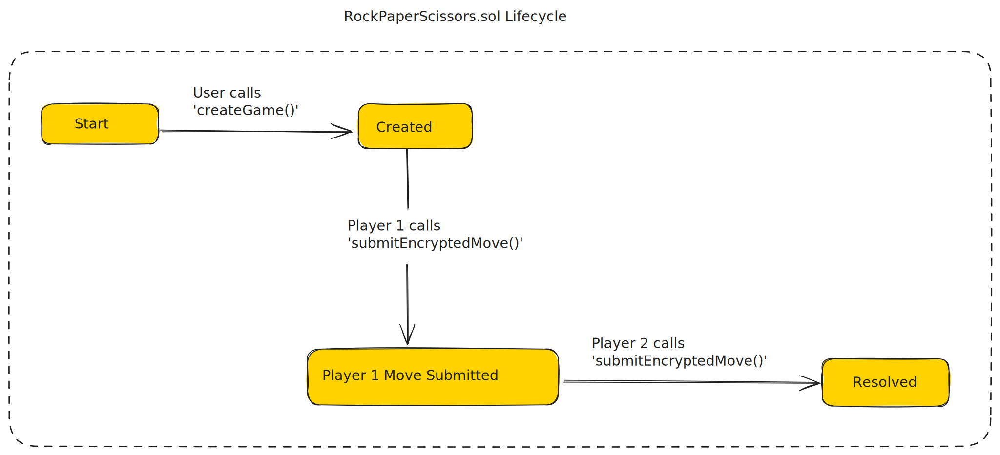

## Part 2: The Confidential Smart Contract (`RockPaperScissors.sol`)

In this section, we'll start writing code, starting from our confidential smart contract `RockPaperScissors.sol`. Our smart contract will handle running game logic (Rock-Paper-Scissors) on encrypted data. Users submit encrypted data and the contract computes the winner using FHE.

**2.1. Imports and contract declaration**

We need some help from the fhevm solidity library, let's import them. At the top of the file, add:

```solidity
// SPDX-License-Identifier: MIT
pragma solidity ^0.8.24;

import {FHE, euint8, externalEuint8, ebool} from "@fhevm/solidity/lib/FHE.sol";
import {SepoliaConfig} from "@fhevm/solidity/config/ZamaConfig.sol";

/// @title Rock Paper Scissors Game with FHE
/// @author Your Name
/// @notice A privacy-preserving rock paper scissors game using FHEVM
contract RockPaperScissors is SepoliaConfig {

}
```

These imports:

- `FHE` — the core library to work with FHEVM encrypted types
- `euint8` and `externalEuint8` — encrypted `uint8` types used in FHEVM (more on this later). See [list of supported types](https://docs.zama.ai/protocol/solidity-guides/smart-contract/types).
- `SepoliaConfig` — to enable FHEVM support, the contract must inherit from the abstract `SepoliaConfig` contract. Without it, the contract will not be able to execute any FHEVM-related functionality on Sepolia or Hardhat.

**2.2. Defining the Game: State Variables, Encrypted Types and Events**

Add these variables and types in the contract body. They will control game state:

```solidity
...
contract RockPaperScissors is SepoliaConfig {
    /// @notice Game status enumeration
    enum GameStatus {
        Created, // Game created, waiting for second player
        Player1MoveSubmitted, // Player1 submitted move, waiting for player 2
        Resolved // Game has been resolved with encrypted result accessible to players
    }

    /// @notice Game structure
    struct Game {
        address player1;
        address player2;
        euint8 move1; // Encrypted move of player1 (0=rock, 1=paper, 2=scissors)
        euint8 move2; // Encrypted move of player2
        euint8 result; // Encrypted result: 0=draw, 1=player1 wins, 2=player2 wins
        GameStatus status;
        uint256 createdAt;
        uint256 resolvedAt;
    }

    /// @notice Mapping of game ID to game data
    mapping(uint256 gameId => Game game) private _games;

    /// @notice Counter for generating unique game IDs
    uint256 private _nextGameId = 1;

    /// @notice Events
    event GameCreated(uint256 indexed gameId, address indexed player1);
    event MoveSubmitted(uint256 indexed gameId, address indexed player);
    event GameResolved(uint256 indexed gameId);
}
...
```

Let take them one at a time:

**State variables**

- `GameStatus` - this enum represents the three different states in the game:
  - `Created` - this is the initial state of a newly created game.
  - `Player1MoveSubmitted` - player 1 has to submit a move before player 2. The game moves to this state when player 1 submits a move.
  - `Resolved` - once player 2 submits their move, the game will automatically resolve, this is the third and final state of the game.
- `Game` - this struct holds the variables of an individual game: players, moves, results etc. Note the use of `euint8` to store moves and result. This is the one of the key elements keeping the game private.
- `_games` - this holds all games in the smart contract. Whenever a game is created, it is added to this list.
- `_nextGameId` - is a simple id generation mechanism. It generates incremental ids for new games.



**Events**

We'll emit events at key points of a game's lifecycle. This allows us to update the frontend in response to those events. If we wanted to make the frontend responsive without these events, the frontend would have to poll the network regularly e.g every 3 seconds. This is a much cleaner approach.

- `GameCreated` - when a new game is created.
- `MoveSubmitted` - when either player submits a move.
- `GameResolved` - when a game completes.

**2.3. Starting a game: `createGame()`**

```solidity
...
    event MoveSubmitted(uint256 indexed gameId, address indexed player);
    event GameResolved(uint256 indexed gameId);

    /// @notice Creates a new game
    /// @return gameId The unique identifier for the new game
    function createGame() external returns (uint256 gameId) {
        gameId = _nextGameId++;

        _games[gameId] = Game({
            player1: msg.sender,
            player2: address(0),
            move1: FHE.asEuint8(0),
            move2: FHE.asEuint8(0),
            result: FHE.asEuint8(0),
            status: GameStatus.Created,
            createdAt: block.timestamp,
            resolvedAt: 0
        });

        emit GameCreated(gameId, msg.sender);
    }
}
```

The `createGame()` function is our starting point. It handles the standard logic for initializing a game: incrementing a counter for a new `gameId`, assigning the creator as `player1`, setting the status to `Created`, setting default values for for moves and results, and emitting the `GameCreated` event.

**2.4. Making a Private Move: `submitEncryptedMove()`**

Now let's add the the `submitEncryptedMove` function.

This function records a player's encrypted move and processes it without ever knowing what it is.

```solidity
    }

    /// @notice Submits an encrypted move for a game
    /// @param gameId The game identifier
    /// @param encryptedMove The encrypted move (0=rock, 1=paper, 2=scissors)
    /// @param inputProof The zero-knowledge proof for the encrypted input
    function submitEncryptedMove(uint256 gameId, externalEuint8 encryptedMove, bytes calldata inputProof) external {
        Game storage game = _games[gameId];
        require(game.player1 != address(0), "Game does not exist");
        require(game.status != GameStatus.Resolved, "Game is already resolved");

        euint8 move = FHE.fromExternal(encryptedMove, inputProof);

        // Validate and normalize move to range (0, 1, 2) using modulo 3 operation in FHE
        // For any input, this will map it to 0, 1, or 2
        euint8 validatedMove = FHE.rem(move, 3);

        if (msg.sender == game.player1) {
            // Player 1 is submitting their move
            require(game.status == GameStatus.Created, "Player1 can only submit in Created state");

            game.move1 = validatedMove;
            game.status = GameStatus.Player1MoveSubmitted;
        } else {
            // This is player 2 joining and submitting their move
            require(game.status == GameStatus.Player1MoveSubmitted, "Player1 must submit their move first");

            game.player2 = msg.sender;
            game.move2 = validatedMove;

            // When player 2 submits their move, we can immediately resolve the game.
            _resolveGame(gameId, game);
        }

        // Allow the contract to use this move in future computations
        // Only allow the submitting player to decrypt their own move
        FHE.allowThis(validatedMove);
        FHE.allow(validatedMove, msg.sender);

        emit MoveSubmitted(gameId, msg.sender);
    }
}
```

Let's break this down step by step:

```solidity
function submitEncryptedMove(uint256 gameId, externalEuint8 encryptedMove, bytes calldata inputProof) external {
```

The key input parameters for the function are: `encryptedMove`, which is the player's move encrypted on the frontend, it is the `externalEuint8` type - an encrypted integer produced off-chain by the function caller (player), and `inputProof` which is an additional argument to ensure the validity of the external encrypted value (`encryptedMove`).

These two checks are critical to maintaining the integrity and security of external encrypted data used in the FHEVM, preventing malicious actors from submitting invalid or tampered encrypted values. Conveniently, the `@fhevm/react` library generates this for us on the client-side.

Inside the function, after running checks we do some FHE specific actions:

```solidity
euint8 move = FHE.fromExternal(encryptedMove, inputProof);
```

This line verifies the zero-knowledge proof and returns a usable encrypted value within the contract. This makes the `externalEuint8` usable in the smart contract.

```solidity
euint8 validatedMove = FHE.rem(move, 3);
```

Instead of the usual solidity check like `require(move < 3)` which is impossible in FHEVM (result of comparisons are encrypted values), we make sure input is valid by sanitizing the input using the remainder operation.

```solidity
if (msg.sender == game.player1) {
    // Player 1 is submitting their move
    require(game.status == GameStatus.Created, "Player1 can only submit in Created state");

    game.move1 = validatedMove;
    game.status = GameStatus.Player1MoveSubmitted;
} else {
    // This is player 2 joining and submitting their move
    require(game.status == GameStatus.Player1MoveSubmitted, "Player1 must submit their move first");

    game.player2 = msg.sender;
    game.move2 = validatedMove;

    // When player 2 submits their move, we can immediately resolve the game.
    _resolveGame(gameId, game);
}
```

After validation, the contract records the player's move, updates game state, and resolves the game if necessary.

Finally, before emitting our event we must handle permissions for the encrypted move. We do that using two function calls that work together:

```solidity
FHE.allowThis(validatedMove);
FHE.allow(validatedMove, msg.sender);
```

Let's explain the importance of these calls:

- `FHE.allowThis()` - grants permission to the smart contract to use this value in future transactions, this is critical for the next step in our game. Without it, the confidential comparison of player moves in `_resolveGame()` will fail.
- `FHE.allow()` - grants permission to the player who submitted a move to decrypt it. For the decryption to work, it also depends on the first permission to have been granted.

**2.5. The Blind Refree: `_resolveGame()`**

Let's build the `_resolveGame()` function:

```solidity
...
        emit MoveSubmitted(gameId, msg.sender);
    }

    /// @notice Internal function to resolve the game and compute the encrypted result
    /// @param gameId The game identifier
    /// @param game The game storage reference
    function _resolveGame(uint256 gameId, Game storage game) internal {
        // function body
    }
}
```

The `_resolveGame()` private function is where the result of the game is determined. It acts as "blind refree", computing the result of the game without knowing the moves or result.

The function determines the winner by testing for different outcomes before putting them together to create the value for the final result.

```solidity
...
    /// @notice Internal function to resolve the game and compute the encrypted result
    /// @param gameId The game identifier
    /// @param game The game storage reference
    function _resolveGame(uint256 gameId, Game storage game) internal {
        // Compute the winner using FHE operations without exposing individual moves
        // Rock=0, Paper=1, Scissors=2
        // Rock beats Scissors, Paper beats Rock, Scissors beats Paper

        // Create constants for comparison
        euint8 zero = FHE.asEuint8(0);
        euint8 one = FHE.asEuint8(1);
        euint8 two = FHE.asEuint8(2);

        // Check for draw (move1 == move2)
        ebool isDraw = FHE.eq(game.move1, game.move2);

        // Check all winning conditions for player1:
        // Player1 wins if: (move1=0 && move2=2) || (move1=1 && move2=0) || (move1=2 && move2=1)

        // Player1 plays Rock (0) and Player2 plays Scissors (2)
        ebool p1RockVsP2Scissors = FHE.and(FHE.eq(game.move1, zero), FHE.eq(game.move2, two));

        // Player1 plays Paper (1) and Player2 plays Rock (0)
        ebool p1PaperVsP2Rock = FHE.and(FHE.eq(game.move1, one), FHE.eq(game.move2, zero));

        // Player1 plays Scissors (2) and Player2 plays Paper (1)
        ebool p1ScissorsVsP2Paper = FHE.and(FHE.eq(game.move1, two), FHE.eq(game.move2, one));

        // Player1 wins if any of the above conditions are true
        ebool player1Wins = FHE.or(FHE.or(p1RockVsP2Scissors, p1PaperVsP2Rock), p1ScissorsVsP2Paper);

        // Compute the final result:
        // If draw: result = 0
        // If player1 wins: result = 1
        // If player2 wins: result = 2

        // First, determine if it's a draw (0) or not
        euint8 resultIfNotDraw = FHE.select(player1Wins, one, two);
        game.result = FHE.select(isDraw, zero, resultIfNotDraw);

        // Grant both players access to decrypt ONLY the result, not individual moves
        FHE.allowThis(game.result);
        FHE.allow(game.result, game.player1);
        FHE.allow(game.result, game.player2);

        game.status = GameStatus.Resolved;
        game.resolvedAt = block.timestamp;

        emit GameResolved(gameId);
    }
}
```

We check for a draw using `FHE.eq` (FHEVM version of equality check) and get back an encrypted boolean which privately holds that result.

```solidity
ebool isDraw = FHE.eq(game.move1, game.move2);
```

Next we test for the different win conditions for Player 1 and combine them using other FHEVM comparison operators `FHE.and` and `FHE.or`.

```solidity
// Player1 plays Rock (0) and Player2 plays Scissors (2)
ebool p1RockVsP2Scissors = FHE.and(FHE.eq(game.move1, zero), FHE.eq(game.move2, two));

// Player1 plays Paper (1) and Player2 plays Rock (0)
ebool p1PaperVsP2Rock = FHE.and(FHE.eq(game.move1, one), FHE.eq(game.move2, zero));

// Player1 plays Scissors (2) and Player2 plays Paper (1)
ebool p1ScissorsVsP2Paper = FHE.and(FHE.eq(game.move1, two), FHE.eq(game.move2, one));

// Player1 wins if any of the above conditions are true
ebool player1Wins = FHE.or(FHE.or(p1RockVsP2Scissors, p1PaperVsP2Rock), p1ScissorsVsP2Paper);
```

With booleans representing draw and Player 1 win conditions in hand, we determine the final result using the `FHE.select` ternary operator, result is `zero` if it `isDraw` is true or `resultIfNotDraw` otherwise.

```solidity
// First, determine if it's a draw (0) or not
euint8 resultIfNotDraw = FHE.select(player1Wins, one, two);
game.result = FHE.select(isDraw, zero, resultIfNotDraw);
```

At the end, both players are given permission to view the `game.result`.

```solidity
// Grant both players access to decrypt ONLY the result, not individual moves
FHE.allowThis(game.result);
FHE.allow(game.result, game.player1);
FHE.allow(game.result, game.player2);
```

Notice that a player only ever "sees" their move and the result. Although a player can deduce the other player's moves based on the result, it's only because this is a simple game. The game runs to completion, without either the smart contract nor non-participants ever seeing player moves or the result of a game.

**2.6. State getters: `getNextGameId()` and `getGame()`**

We expose public getter functions - `getGame()` to fetch game state for a specific game and `getNextGameId()` to fetch the current value of `_nextGameId`.

```
...
        emit GameResolved(gameId);
    }

    /// @notice Get the next game ID (public getter for latest game ID = nextGameId - 1)
    /// @return The next game ID to be assigned
    function getNextGameId() external view returns (uint256) {
        return _nextGameId;
    }


    /// @notice Gets game information
    /// @param gameId The game identifier
    /// @return player1 Address of player 1
    /// @return player2 Address of player 2
    /// @return move1 Encrypted move of player 1
    /// @return move2 Encrypted move of player 2
    /// @return result Encrypted game result
    /// @return status Current game status
    /// @return createdAt Timestamp when game was created
    /// @return resolvedAt Timestamp when game was resolved
    function getGame(
        uint256 gameId
    )
        external
        view
        returns (
            address player1,
            address player2,
            euint8 move1,
            euint8 move2,
            euint8 result,
            GameStatus status,
            uint256 createdAt,
            uint256 resolvedAt
        )
    {
        Game storage game = _games[gameId];
        require(game.player1 != address(0), "Game does not exist");

        return (
            game.player1,
            game.player2,
            game.move1,
            game.move2,
            game.result,
            game.status,
            game.createdAt,
            game.resolvedAt
        );
    }
}
```

This completes our confidential contract for the game. But a contract is only half the story, users need an interface to play.

This leaves us with some key challenges as we move to the next section. Challenges such as:

- how are `externalEuint8` and `inputProof` are created in the browser?
- how do we decrypt the encrypted game result?

In the next section, we'll answer these questions as we build our React frontend.
