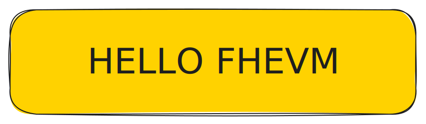
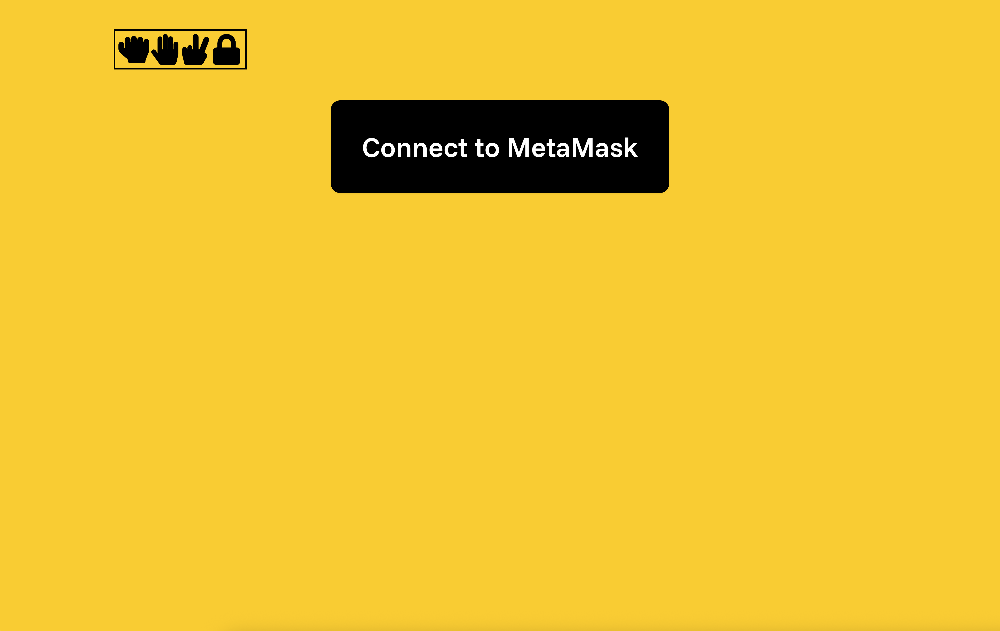
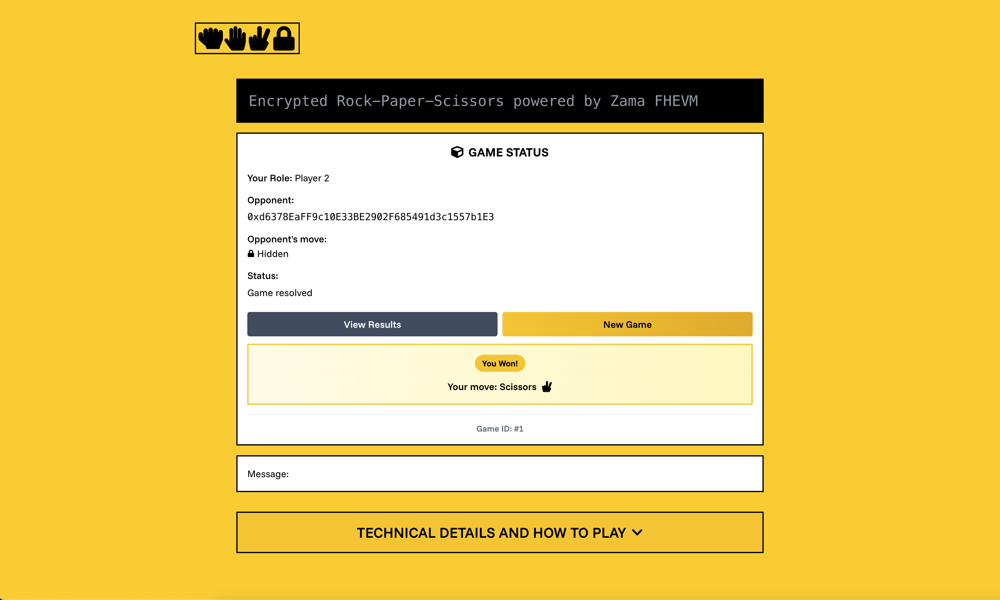

# Building Your First Confidential DApp: A "Hello FHEVM" Tutorial with Rock-Paper-Scissors



## Introduction

What if you could build dApps where user data remains private? Multiple users can submit data, smart contracts can compute on that data, all while that data remains hidden from other users and even the smart contract itself. That might sound like magic but that's exactly what Zama's FHEVM enables.

### What is FHEVM?

From the [Zama whitepaper](https://github.com/zama-ai/fhevm/blob/main/fhevm-whitepaper.pdf)

> Zama's fhevm is a cross-chain protocol that enables confidential smart contracts on any L1 and L2 using Fully Homomorphic Encryption (FHE). It brings end-to-end encryption to onchain applications, guaranteeing confidentiality and privacy while remaining fully composable, verifiable, and permissionless

Did you get that? If you didn't, it's alright. Let's break that down:

- FHE is technology that enables computation over encrypted data. Imagine voting in an election where each person's vote is private, but the election result can be computed without revealing any single person's vote. Complex math behind the scenes makes this possible.

- FHEVM is a collection of technologies that work together to bring FHE capabilities to onchain applications on any L1 or L2. Developers get to use familiar languages like Solidity without having to think about the mathematical complexity behind it. Feel free to read the [whitepaper](https://github.com/zama-ai/fhevm/blob/main/fhevm-whitepaper.pdf) or [litepaper](https://docs.zama.ai/protocol/zama-protocol-litepaper#technical-details) for more info.

### What We'll Build

To demonstrate the the power of FHE and the ease of FHEVM, we're going to build a Rock-Paper-Scissors dApp. It's a [classic game](https://en.wikipedia.org/wiki/Rock_paper_scissors), but here's the twist - with the power of FHE, users will submit encrypted moves, the contract determines the winner without ever knowing the moves or the result. Only the players can see the result.

For those curious about the end result, here is a [link to the completed Github repo](https://github.com/ego-errante/hello-fhevm) and here's a [link to the deployed dApp](https://hello-fhevm.netlify.app/).

### Learning Objectives

At the end of this tutorial, the reader will hopefully:

- Understand the basics of FHEVM and why it matters.
- Be able to set up the dev environment.
- Deploy and interact with a simple FHEVM dApp end-to-end.
- Be confident to start experimenting with more advanced use cases.

### Prerequisites

To follow along, no prior knowledge of FHE or cryptography is required; the tutorial assumes zero background in advanced math or cryptography. However, the reader is expected to:

- Have basic Solidity knowledge (comfortable writing and deploying simple smart contracts).
- Be familiar with standard Ethereum dev tools (e.g. Hardhat, Foundry, Metamask).
- Have basic familiarity with React.

## Part 1: Setting Up Your FHEVM Environment

To get started, let's setup up our dev environment.

**1.1. Install a Node.js TLS version**

- Ensure that Node.js is installed on your machine.
- Download and install the recommended LTS (Long-Term Support) version from the [official website](https://nodejs.org/en).
- Use an even-numbered version (e.g., v18.x, v20.x).
- To verify your installation:

  ```
  node -v
  npm -v
  ```

**1.2. Create a new GitHub repository from the FHEVM React template**

- On GitHub, navigate to the main page of the [FHEVM React template](https://github.com/zama-ai/fhevm-react-template/) repository.
- Above the file list, click the green Use this template button.
- Follow the instructions to create a new repository from the FHEVM Hardhat template. You can name it anything you like (e.g., "my-fhevm-dapp", "rock-paper-scissors-fhe", etc.).

**Note:** For this tutorial, we'll assume you named your repository `hello-fhevm`. If you chose a different name, simply substitute `hello-fhevm` with your chosen repository name throughout this tutorial.

See Github doc for more info: [Creating a repository from a template](https://docs.github.com/en/repositories/creating-and-managing-repositories/creating-a-repository-from-a-template#creating-a-repository-from-a-template)

**1.3. Clone your newly created GitHub repository locally:**
Now that your GitHub repository has been created, you can clone it to your local machine:

```
cd <your-preferred-location>
git clone <url-to-your-new-repo>
# Navigate to the root of your new FHEVM Hardhat project

cd hello-fhevm
```

**1.4. Install Dependencies:** Before we install dependencies, let's briefly look at the structure of the project. Here's what the file tree looks like inside your local clone of the repo:

```
hello-fhevm/
├── LICENSE
├── README.md
├── package-lock.json
├── package.json
├── packages/
│   ├── fhevm-hardhat-template/
│   ├── fhevm-react/
│   ├── postdeploy/
│   └── site/
```

We will focus on `hello-fhevm/packages/fhevm-hardhat-template` for our Hardhat project concerned with writing and deploying our smart contract and `hello-fhevm/packages/site` for building our interactive frontend with Next.js.
Before installing, we'll update the package.json files to remove scripts that are only needed for local Hardhat development.

Remove this `postinstall` script line in `hello-fhevm/package.json`:

```json
...
    "postinstall": "./scripts/deploy-hardhat-node.sh",
...
```

In `hello-fhevm/packages/site/package.json`, update the `dev:mock` command by removing the `npm run is-hardhat-node-running` test, leaving just:

```json
...
    "dev:mock": "next dev --turbopack",
...
```

To install dependencies for both, run:

```bash
# in the repo root
npm install
```

**1.5. Set up the Hardhat configuration variables**

We will be deploying the smart contract to the Sepolia Ethereum Testnet.

**1.5.1. MNEMONIC**

A mnemonic is a 12-word seed phrase used to generate your Ethereum wallet keys.

Get one by creating a wallet with MetaMask, or using any trusted mnemonic generator.

Set it up in your Hardhat project - `hello-fhevm/packages/fhevm-hardhat-template`:

```bash
npx hardhat vars set MNEMONIC
```

**1.5.2. INFURA_API_KEY**

The INFURA project key allows you to connect to Ethereum testnets like Sepolia.

Obtain one by following the [Infura + MetaMask](https://docs.metamask.io/services/get-started/infura/) setup guide.

Configure it in your project:

```bash
npx hardhat vars set INFURA_API_KEY
```

**1.5.3. Default Values**

If you skip this step, Hardhat will fall back to these defaults:

- MNEMONIC = "test test test test test test test test test test test junk"
- INFURA_API_KEY = "zzzzzzzzzzzzzzzzzzzzzzzzzzzzzzzz"

**1.6. Get Testnet Funds:** You can get Sepolia testnet funds from different providers for free. Here are some faucets:

- https://faucets.chain.link/sepolia
- https://www.alchemy.com/faucets/ethereum-sepolia
- https://cloud.google.com/application/web3/faucet/ethereum/sepolia

## Part 2: The Confidential Smart Contract (`RockPaperScissors.sol`)

In this section, we'll start writing code, starting from our confidential smart contract `RockPaperScissors.sol`. Our smart contract will handle running game logic (Rock-Paper-Scissors) on encrypted data. Users submit encrypted data and the contract computes the winner using FHE.

**2.1. Imports and contract declaration**

We need some help from the fhevm solidity library, let's import them. At the top of the file, add:

```solidity
// SPDX-License-Identifier: MIT
pragma solidity ^0.8.24;

import {FHE, euint8, externalEuint8, ebool} from "@fhevm/solidity/lib/FHE.sol";
import {SepoliaConfig} from "@fhevm/solidity/config/ZamaConfig.sol";

/// @title Rock Paper Scissors Game with FHE
/// @author Your Name
/// @notice A privacy-preserving rock paper scissors game using FHEVM
contract RockPaperScissors is SepoliaConfig {

}
```

These imports:

- `FHE` — the core library to work with FHEVM encrypted types
- `euint8` and `externalEuint8` — encrypted `uint8` types used in FHEVM (more on this later). See [list of supported types](https://docs.zama.ai/protocol/solidity-guides/smart-contract/types).
- `SepoliaConfig` — to enable FHEVM support, the contract must inherit from the abstract `SepoliaConfig` contract. Without it, the contract will not be able to execute any FHEVM-related functionality on Sepolia or Hardhat.

**2.2. Defining the Game: State Variables, Encrypted Types and Events**

Add these variables and types in the contract body. They will control game state:

```solidity
...
contract RockPaperScissors is SepoliaConfig {
    /// @notice Game status enumeration
    enum GameStatus {
        Created, // Game created, waiting for second player
        Player1MoveSubmitted, // Player1 submitted move, waiting for player 2
        Resolved // Game has been resolved with encrypted result accessible to players
    }

    /// @notice Game structure
    struct Game {
        address player1;
        address player2;
        euint8 move1; // Encrypted move of player1 (0=rock, 1=paper, 2=scissors)
        euint8 move2; // Encrypted move of player2
        euint8 result; // Encrypted result: 0=draw, 1=player1 wins, 2=player2 wins
        GameStatus status;
        uint256 createdAt;
        uint256 resolvedAt;
    }

    /// @notice Mapping of game ID to game data
    mapping(uint256 gameId => Game game) private _games;

    /// @notice Counter for generating unique game IDs
    uint256 private _nextGameId = 1;

    /// @notice Events
    event GameCreated(uint256 indexed gameId, address indexed player1);
    event MoveSubmitted(uint256 indexed gameId, address indexed player);
    event GameResolved(uint256 indexed gameId);
}
...
```

Let take them one at a time:

**State variables**

- `GameStatus` - this enum represents the three different states in the game:
  - `Created` - this is the initial state of a newly created game.
  - `Player1MoveSubmitted` - player 1 has to submit a move before player 2. The game moves to this state when player 1 submits a move.
  - `Resolved` - once player 2 submits their move, the game will automatically resolve, this is the third and final state of the game.
- `Game` - this struct holds the variables of an individual game: players, moves, results etc. Note the use of `euint8` to store moves and result. This is the one of the key elements keeping the game private.
- `_games` - this holds all games in the smart contract. Whenever a game is created, it is added to this list.
- `_nextGameId` - is a simple id generation mechanism. It generates incremental ids for new games.


**Events**

We'll emit events at key points of a game's lifecycle. This allows us to update the frontend in response to those events. If we wanted to make the frontend responsive without these events, the frontend would have to poll the network regularly e.g every 3 seconds. This is a much cleaner approach.

- `GameCreated` - when a new game is created.
- `MoveSubmitted` - when either player submits a move.
- `GameResolved` - when a game completes.

**2.3. Starting a game: `createGame()`**

```solidity
...
    event MoveSubmitted(uint256 indexed gameId, address indexed player);
    event GameResolved(uint256 indexed gameId);

    /// @notice Creates a new game
    /// @return gameId The unique identifier for the new game
    function createGame() external returns (uint256 gameId) {
        gameId = _nextGameId++;

        _games[gameId] = Game({
            player1: msg.sender,
            player2: address(0),
            move1: FHE.asEuint8(0),
            move2: FHE.asEuint8(0),
            result: FHE.asEuint8(0),
            status: GameStatus.Created,
            createdAt: block.timestamp,
            resolvedAt: 0
        });

        emit GameCreated(gameId, msg.sender);
    }
}
```

The `createGame()` function is our starting point. It handles the standard logic for initializing a game: incrementing a counter for a new `gameId`, assigning the creator as `player1`, setting the status to `Created`, setting default values for for moves and results, and emitting the `GameCreated` event.

**2.4. Making a Private Move: `submitEncryptedMove()`**

Now let's add the the `submitEncryptedMove` function.

This function records a player's encrypted move and processes it without ever knowing what it is.

```solidity
    }

    /// @notice Submits an encrypted move for a game
    /// @param gameId The game identifier
    /// @param encryptedMove The encrypted move (0=rock, 1=paper, 2=scissors)
    /// @param inputProof The zero-knowledge proof for the encrypted input
    function submitEncryptedMove(uint256 gameId, externalEuint8 encryptedMove, bytes calldata inputProof) external {
        Game storage game = _games[gameId];
        require(game.player1 != address(0), "Game does not exist");
        require(game.status != GameStatus.Resolved, "Game is already resolved");

        euint8 move = FHE.fromExternal(encryptedMove, inputProof);

        // Validate and normalize move to range (0, 1, 2) using modulo 3 operation in FHE
        // For any input, this will map it to 0, 1, or 2
        euint8 validatedMove = FHE.rem(move, 3);

        if (msg.sender == game.player1) {
            // Player 1 is submitting their move
            require(game.status == GameStatus.Created, "Player1 can only submit in Created state");

            game.move1 = validatedMove;
            game.status = GameStatus.Player1MoveSubmitted;
        } else {
            // This is player 2 joining and submitting their move
            require(game.status == GameStatus.Player1MoveSubmitted, "Player1 must submit their move first");

            game.player2 = msg.sender;
            game.move2 = validatedMove;

            // When player 2 submits their move, we can immediately resolve the game.
            _resolveGame(gameId, game);
        }

        // Allow the contract to use this move in future computations
        // Only allow the submitting player to decrypt their own move
        FHE.allowThis(validatedMove);
        FHE.allow(validatedMove, msg.sender);

        emit MoveSubmitted(gameId, msg.sender);
    }
}
```

Let's break this down step by step:

```solidity
function submitEncryptedMove(uint256 gameId, externalEuint8 encryptedMove, bytes calldata inputProof) external {
```

The key input parameters for the function are: `encryptedMove`, which is the player's move encrypted on the frontend, it is the `externalEuint8` type - an encrypted integer produced off-chain by the function caller (player), and `inputProof` which is an additional argument to ensure the validity of the external encrypted value (`encryptedMove`).

These two checks are critical to maintaining the integrity and security of external encrypted data used in the FHEVM, preventing malicious actors from submitting invalid or tampered encrypted values. Conveniently, the `@fhevm/react` library generates this for us on the client-side.

Inside the function, after running checks we do some FHE specific actions:

```solidity
euint8 move = FHE.fromExternal(encryptedMove, inputProof);
```

This line verifies the zero-knowledge proof and returns a usable encrypted value within the contract. This makes the `externalEuint8` usable in the smart contract.

```solidity
euint8 validatedMove = FHE.rem(move, 3);
```

Instead of the usual solidity check like `require(move < 3)` which is impossible in FHEVM (result of comparisons are encrypted values), we make sure input is valid by sanitizing the input using the remainder operation.

```solidity
if (msg.sender == game.player1) {
    // Player 1 is submitting their move
    require(game.status == GameStatus.Created, "Player1 can only submit in Created state");

    game.move1 = validatedMove;
    game.status = GameStatus.Player1MoveSubmitted;
} else {
    // This is player 2 joining and submitting their move
    require(game.status == GameStatus.Player1MoveSubmitted, "Player1 must submit their move first");

    game.player2 = msg.sender;
    game.move2 = validatedMove;

    // When player 2 submits their move, we can immediately resolve the game.
    _resolveGame(gameId, game);
}
```

After validation, the contract records the player's move, updates game state, and resolves the game if necessary.

Finally, before emitting our event we must handle permissions for the encrypted move. We do that using two function calls that work together:

```solidity
FHE.allowThis(validatedMove);
FHE.allow(validatedMove, msg.sender);
```

Let's explain the importance of these calls:

- `FHE.allowThis()` - grants permission to the smart contract to use this value in future transactions, this is critical for the next step in our game. Without it, the confidential comparison of player moves in `_resolveGame()` will fail.
- `FHE.allow()` - grants permission to the player who submitted a move to decrypt it. For the decryption to work, it also depends on the first permission to have been granted.

**2.5. The Blind Refree: `_resolveGame()`**

Let's build the `_resolveGame()` function:

```solidity
...
        emit MoveSubmitted(gameId, msg.sender);
    }

    /// @notice Internal function to resolve the game and compute the encrypted result
    /// @param gameId The game identifier
    /// @param game The game storage reference
    function _resolveGame(uint256 gameId, Game storage game) internal {
        // function body
    }
}
```

The `_resolveGame()` private function is where the result of the game is determined. It acts as "blind refree", computing the result of the game without knowing the moves or result.

The function determines the winner by testing for different outcomes before putting them together to create the value for the final result.

```solidity
...
    /// @notice Internal function to resolve the game and compute the encrypted result
    /// @param gameId The game identifier
    /// @param game The game storage reference
    function _resolveGame(uint256 gameId, Game storage game) internal {
        // Compute the winner using FHE operations without exposing individual moves
        // Rock=0, Paper=1, Scissors=2
        // Rock beats Scissors, Paper beats Rock, Scissors beats Paper

        // Create constants for comparison
        euint8 zero = FHE.asEuint8(0);
        euint8 one = FHE.asEuint8(1);
        euint8 two = FHE.asEuint8(2);

        // Check for draw (move1 == move2)
        ebool isDraw = FHE.eq(game.move1, game.move2);

        // Check all winning conditions for player1:
        // Player1 wins if: (move1=0 && move2=2) || (move1=1 && move2=0) || (move1=2 && move2=1)

        // Player1 plays Rock (0) and Player2 plays Scissors (2)
        ebool p1RockVsP2Scissors = FHE.and(FHE.eq(game.move1, zero), FHE.eq(game.move2, two));

        // Player1 plays Paper (1) and Player2 plays Rock (0)
        ebool p1PaperVsP2Rock = FHE.and(FHE.eq(game.move1, one), FHE.eq(game.move2, zero));

        // Player1 plays Scissors (2) and Player2 plays Paper (1)
        ebool p1ScissorsVsP2Paper = FHE.and(FHE.eq(game.move1, two), FHE.eq(game.move2, one));

        // Player1 wins if any of the above conditions are true
        ebool player1Wins = FHE.or(FHE.or(p1RockVsP2Scissors, p1PaperVsP2Rock), p1ScissorsVsP2Paper);

        // Compute the final result:
        // If draw: result = 0
        // If player1 wins: result = 1
        // If player2 wins: result = 2

        // First, determine if it's a draw (0) or not
        euint8 resultIfNotDraw = FHE.select(player1Wins, one, two);
        game.result = FHE.select(isDraw, zero, resultIfNotDraw);

        // Grant both players access to decrypt ONLY the result, not individual moves
        FHE.allowThis(game.result);
        FHE.allow(game.result, game.player1);
        FHE.allow(game.result, game.player2);

        game.status = GameStatus.Resolved;
        game.resolvedAt = block.timestamp;

        emit GameResolved(gameId);
    }
}
```

We check for a draw using `FHE.eq` (FHEVM version of equality check) and get back an encrypted boolean which privately holds that result.

```solidity
ebool isDraw = FHE.eq(game.move1, game.move2);
```

Next we test for the different win conditions for Player 1 and combine them using other FHEVM comparison operators `FHE.and` and `FHE.or`.

```solidity
// Player1 plays Rock (0) and Player2 plays Scissors (2)
ebool p1RockVsP2Scissors = FHE.and(FHE.eq(game.move1, zero), FHE.eq(game.move2, two));

// Player1 plays Paper (1) and Player2 plays Rock (0)
ebool p1PaperVsP2Rock = FHE.and(FHE.eq(game.move1, one), FHE.eq(game.move2, zero));

// Player1 plays Scissors (2) and Player2 plays Paper (1)
ebool p1ScissorsVsP2Paper = FHE.and(FHE.eq(game.move1, two), FHE.eq(game.move2, one));

// Player1 wins if any of the above conditions are true
ebool player1Wins = FHE.or(FHE.or(p1RockVsP2Scissors, p1PaperVsP2Rock), p1ScissorsVsP2Paper);
```

With booleans representing draw and Player 1 win conditions in hand, we determine the final result using the `FHE.select` ternary operator, result is `zero` if it `isDraw` is true or `resultIfNotDraw` otherwise.

```solidity
// First, determine if it's a draw (0) or not
euint8 resultIfNotDraw = FHE.select(player1Wins, one, two);
game.result = FHE.select(isDraw, zero, resultIfNotDraw);
```

At the end, both players are given permission to view the `game.result`.

```solidity
// Grant both players access to decrypt ONLY the result, not individual moves
FHE.allowThis(game.result);
FHE.allow(game.result, game.player1);
FHE.allow(game.result, game.player2);
```

Notice that a player only ever "sees" their move and the result. Although a player can deduce the other player's moves based on the result, it's only because this is a simple game. The game runs to completion, without either the smart contract nor non-participants ever seeing player moves or the result of a game.

**2.6. State getters: `getNextGameId()` and `getGame()`**

We expose public getter functions - `getGame()` to fetch game state for a specific game and `getNextGameId()` to fetch the current value of `_nextGameId`.

```
...
        emit GameResolved(gameId);
    }

    /// @notice Get the next game ID (public getter for latest game ID = nextGameId - 1)
    /// @return The next game ID to be assigned
    function getNextGameId() external view returns (uint256) {
        return _nextGameId;
    }


    /// @notice Gets game information
    /// @param gameId The game identifier
    /// @return player1 Address of player 1
    /// @return player2 Address of player 2
    /// @return move1 Encrypted move of player 1
    /// @return move2 Encrypted move of player 2
    /// @return result Encrypted game result
    /// @return status Current game status
    /// @return createdAt Timestamp when game was created
    /// @return resolvedAt Timestamp when game was resolved
    function getGame(
        uint256 gameId
    )
        external
        view
        returns (
            address player1,
            address player2,
            euint8 move1,
            euint8 move2,
            euint8 result,
            GameStatus status,
            uint256 createdAt,
            uint256 resolvedAt
        )
    {
        Game storage game = _games[gameId];
        require(game.player1 != address(0), "Game does not exist");

        return (
            game.player1,
            game.player2,
            game.move1,
            game.move2,
            game.result,
            game.status,
            game.createdAt,
            game.resolvedAt
        );
    }
}
```

This completes our confidential contract for the game. But a contract is only half the story, users need an interface to play.

This leaves us with some key challenges as we move to the next section. Challenges such as:

- how are `externalEuint8` and `inputProof` are created in the browser?
- how do we decrypt the encrypted game result?

In the next section, we'll answer these questions as we build our React frontend.

### Part 3: Building the Frontend (React + `@fhevm/react`)

Our confidential smart contract has been created. But how do players interact with it? In this section, we'll build the client-side application that integrates with our confidential smart contract, from creating and submitting encrypted values for computation to decrypting the result for users.

We'll use the `@fhevm/react` library, a powerful toolkit that simplifies all the complex cryptography into a few simple React hooks.

_**A Quick Note on Architecture:** The template's frontend is built with modularity in mind, using a series of custom hooks (`useFhevm`, `useGameActions`, etc.) that work together. While this is great for production code, our focus will be on the **specific FHEVM function calls** within these hooks. We'll follow the user's journey through the dApp to see how it all connects._

For this section, we'll be working in `packages/site`. Keep that in mind.

**3.1. Add third party libraries**

```bash
# in packages/site
npm install @tanstack/react-query react-icons
```

This installs `@tanstack/react-query` for clean request management and `react-icons` to provide visual icons for our game interface.

**3.2. Update `hello-fhevm/packages/site/providers.tsx`**

Update your `hello-fhevm/packages/site/providers.tsx` to the below:

```typescript
"use client";

import type { ReactNode } from "react";
import { QueryClient, QueryClientProvider } from "@tanstack/react-query";

import { MetaMaskProvider } from "@/hooks/metamask/useMetaMaskProvider";
import { InMemoryStorageProvider } from "@/hooks/useInMemoryStorage";
import { MetaMaskEthersSignerProvider } from "@/hooks/metamask/useMetaMaskEthersSigner";

// Create a client
const queryClient = new QueryClient({
  defaultOptions: {
    queries: {
      staleTime: 1000 * 60 * 5, // 5 minutes
      refetchOnWindowFocus: false,
    },
  },
});

type Props = {
  children: ReactNode;
};

export function Providers({ children }: Props) {
  return (
    <QueryClientProvider client={queryClient}>
      <MetaMaskProvider>
        <MetaMaskEthersSignerProvider
          initialMockChains={{
            11155111: "https://sepolia.infura.io/v3/<your-infura-api-key>",
          }}
        >
          <InMemoryStorageProvider>{children}</InMemoryStorageProvider>
        </MetaMaskEthersSignerProvider>
      </MetaMaskProvider>
    </QueryClientProvider>
  );
}
```

This:

- sets up `react-query` query provider for the frontend.
- configures the default network to ethereum sepolia with a custom rpc url. Replace `<your-infura-api-key>` with the metamask api key you got in part 1.

**3.3. The Core of Frontend Functionality `useRockPaperScissors.tsx`**

Now that our application is set up with providers, let's look at the heart of our game's frontend logic: the `useRockPaperScissors.tsx` hook.


```typescript:hello-fhevm/packages/site/hooks/useRockPaperScissors/useRockPaperScissors.tsx
"use client";

import { ethers } from "ethers";
import { RefObject, useEffect } from "react";
import { useQueryClient } from "@tanstack/react-query";

import { RockPaperScissorsAddresses } from "@/abi/RockPaperScissorsAddresses";
import { RockPaperScissorsABI } from "@/abi/RockPaperScissorsABI";
import { type FhevmInstance, type GenericStringStorage } from "@fhevm/react";
import { useGameState } from "./useGameState";
import { useGameActions } from "./useGameActions";
import { useGameResults } from "./useGameResults";

//////////////////////////////////////////////////////////////////////////////
// Main orchestrating hook for the Rock Paper Scissors game that combines all
// game functionality into a unified interface. Handles contract interactions,
// FHE encryption/decryption, game state management, and provides methods for
// creating games, submitting moves, and viewing results.
//////////////////////////////////////////////////////////////////////////////
export const useRockPaperScissors = (parameters: {
  instance: FhevmInstance | undefined;
  fhevmDecryptionSignatureStorage: GenericStringStorage;
  eip1193Provider: ethers.Eip1193Provider | undefined;
  chainId: number | undefined;
  ethersSigner: ethers.JsonRpcSigner | undefined;
  ethersReadonlyProvider: ethers.ContractRunner | undefined;
  sameChain: RefObject<(chainId: number | undefined) => boolean>;
  sameSigner: RefObject<
    (ethersSigner: ethers.JsonRpcSigner | undefined) => boolean
  >;
  userAddress: `0x${string}` | undefined;
}) => {
  const {
    instance,
    fhevmDecryptionSignatureStorage,
    chainId,
    ethersSigner,
    ethersReadonlyProvider,
    userAddress,
  } = parameters;

  const queryClient = useQueryClient();

  //////////////////////////////////////////////////////////////////////////////
  // Event Listeners
  //////////////////////////////////////////////////////////////////////////////

  useEffect(() => {
    if (!ethersReadonlyProvider || !chainId) return;

    const contractAddress =
      RockPaperScissorsAddresses[
        String(chainId) as keyof typeof RockPaperScissorsAddresses
      ]?.address;
    if (!contractAddress) return;

    const contract = new ethers.Contract(
      contractAddress,
      RockPaperScissorsABI.abi,
      ethersReadonlyProvider
    );

    const invalidateQuery = () => {
      queryClient.invalidateQueries({
        queryKey: ["rock-paper-scissors", "latest-game"],
      });
    };

    contract.on("GameCreated", () => {
      console.log("GameCreated");
      invalidateQuery();
    });
    contract.on("MoveSubmitted", () => {
      console.log("MoveSubmitted");
      invalidateQuery();
    });
    contract.on("GameResolved", () => {
      console.log("GameResolved");
      invalidateQuery();
    });

    return () => {
      contract.off("GameCreated", invalidateQuery);
      contract.off("MoveSubmitted", invalidateQuery);
      contract.off("GameResolved", invalidateQuery);
    };
  }, [ethersReadonlyProvider, chainId, queryClient]);

  //////////////////////////////////////////////////////////////////////////////
  // Sub-hooks for organized logic
  //////////////////////////////////////////////////////////////////////////////

  const gameState = useGameState({
    chainId,
    ethersReadonlyProvider,
    userAddress,
  });

  const gameActions = useGameActions({
    instance,
    ethersSigner,
    rockPaperScissors: gameState.rockPaperScissors,
    latestGame: gameState.latestGame,
    userGameRole: gameState.userGameRole,
    queryClient,
  });

  const gameResults = useGameResults({
    instance,
    ethersSigner,
    fhevmDecryptionSignatureStorage,
    rockPaperScissors: gameState.rockPaperScissors,
    latestGame: gameState.latestGame,
    userGameRole: gameState.userGameRole,
    queryClient,
  });

  return {
    // Contract info
    contractAddress: gameState.rockPaperScissors.address,
    isDeployed: gameState.isDeployed,

    // Game state
    latestGame: gameState.latestGame,
    userGameRole: gameState.userGameRole,

    // Game actions
    canCreateGame: gameActions.canCreateGame,
    createGame: gameActions.createGameMutation.mutate,
    canSubmitMove: gameActions.canSubmitMove,
    submitEncryptedMove: gameActions.submitMoveMutation.mutate,

    // Game results
    gameResult: gameResults.gameResult,
    myMove: gameResults.myMove,
    isViewingResults: gameResults.isViewingResults,
    viewResults: gameResults.fetchGameResults,
    generateDecryptionSignature: gameResults.generateDecryptionSignature,

    // Status - unified loading states
    message: gameActions.message,
    isCreatingGame: gameActions.createGameMutation.isPending,
    isSubmittingMove: gameActions.submitMoveMutation.isPending,
    isLoadingGames: gameState.isLoadingGames,
    isProcessing: gameActions.isProcessing,

    // Error states
    createGameError: gameActions.createGameMutation.error,
    submitMoveError: gameActions.submitMoveMutation.error,
    viewResultsError: gameResults.error,
  };
};
```

Before we explore its responsibilities, let's understand the tools it's given to work with. The `useRockPaperScissors` hook receives several parameters when it's called, but two are essential for all FHEVM operations:

- **`instance: FhevmInstance`**: This is the core object provided by the `@fhevm/react` library. Think of it as our client-side cryptographic engine. It holds the public key needed for encryption and provides the methods we'll use later, such as `encrypt_uint8()` and `decrypt()`. All FHE magic on the frontend happens through this instance.
- **`fhevmDecryptionSignatureStorage: GenericStringStorage`**: This is a helper for caching. To decrypt a value, a user must first sign a message to grant permission. This storage object saves those signatures, so the user doesn't have to sign repeatedly to view the same result.

The other parameters (`ethersSigner`, `chainId`, `userAddress`, etc.) are standard objects from web3 libraries that provide context about the user's wallet and network connection.

This hook is the core of our frontend operations. It doesn't implement all the logic but mainly acts as a central **orchestrator**.

Its key responsibilities are:

- **Combining Sub-Hooks**: It imports and uses our three specialized hooks: `useGameState`, `useGameActions`, and `useGameResults`.
- **Listening for On-Chain Events**: It sets up listeners for our smart contract's events (`GameCreated`, `MoveSubmitted`, `GameResolved`). When one of these events is detected, it automatically tells our app to refetch the latest game state, ensuring the UI is always up-to-date and reactive.
- **Providing a Unified API**: It gathers all the state variables and functions from the sub-hooks and exposes them as a single, clean interface.

By structuring our code this way, we achieve a clean separation of concerns. In the next sections, we will dive into each of the specialized hooks it uses to see exactly how we read game state, handle actions, and process results.

**3.4. Fetching On-Chain State with `useGameState.ts`**

The first specialized hook our orchestrator uses is `useGameState`. Before our app can display anything meaningful, it needs to know the current state of the game on the blockchain. Is there a game running? Is the current user one of the players? This hook is responsible for answering those questions.

```typescript:hello-fhevm/packages/site/hooks/useRockPaperScissors/useGameState.ts
import { ethers } from "ethers";
import { useMemo, useRef } from "react";
import { useQuery } from "@tanstack/react-query";
import { RockPaperScissorsAddresses } from "@/abi/RockPaperScissorsAddresses";
import { RockPaperScissorsABI } from "@/abi/RockPaperScissorsABI";
import { GAME_ROLE } from "@/lib/constants";
import { RockPaperScissorsInfoType, LatestGame, GameData } from "@/lib/types";

//////////////////////////////////////////////////////////////////////////////
// Hook that manages the current state of the Rock Paper Scissors game.
// Handles contract connection, automatically detects the latest active game,
// and determines the user's role (Player 1, Player 2, or spectator).
//////////////////////////////////////////////////////////////////////////////
export function useGameState(parameters: {
  chainId: number | undefined;
  ethersReadonlyProvider: ethers.ContractRunner | undefined;
  userAddress: `0x${string}` | undefined;
}) {
  const { chainId, ethersReadonlyProvider, userAddress } = parameters;

  //////////////////////////////////////////////////////////////////////////////
  // RockPaperScissors Contract
  //////////////////////////////////////////////////////////////////////////////

  const rockPaperScissorsRef = useRef<RockPaperScissorsInfoType | undefined>(
    undefined
  );

  const rockPaperScissors = useMemo(() => {
    const c = getRockPaperScissorsByChainId(chainId);

    rockPaperScissorsRef.current = c;

    return c;
  }, [chainId]);

  const isDeployed = useMemo(() => {
    if (!rockPaperScissors) {
      return undefined;
    }
    return (
      Boolean(rockPaperScissors.address) &&
      rockPaperScissors.address !== ethers.ZeroAddress
    );
  }, [rockPaperScissors]);

  //////////////////////////////////////////////////////////////////////////////
  // Game Detection Logic - Find the latest game
  //////////////////////////////////////////////////////////////////////////////

  const { data: latestGame, isLoading: isLoadingGames } = useQuery({
    queryKey: [
      "rock-paper-scissors",
      "latest-game",
      chainId,
      rockPaperScissors.address,
    ],
    queryFn: async (): Promise<LatestGame | null> => {
      console.log("latestGame queryFn");
      if (
        !rockPaperScissorsRef.current ||
        !rockPaperScissorsRef.current?.chainId ||
        !rockPaperScissorsRef.current?.address ||
        !ethersReadonlyProvider
      ) {
        return null;
      }

      const thisRockPaperScissorsContract = new ethers.Contract(
        rockPaperScissorsRef.current.address,
        rockPaperScissorsRef.current.abi,
        ethersReadonlyProvider
      );

      try {
        // Get the next game ID and check the latest game (nextGameId - 1)
        const nextGameId = await thisRockPaperScissorsContract.getNextGameId();
        const latestGameId = nextGameId - BigInt(1);

        if (latestGameId <= BigInt(0)) {
          // No games exist yet
          return null;
        }

        const gameDataResult =
          await thisRockPaperScissorsContract.getGame(latestGameId);

        // Convert ethers.Result to a proper object to ensure consistency
        const gameData: GameData = {
          player1: gameDataResult[0] as `0x${string}`,
          player2: gameDataResult[1] as `0x${string}`,
          move1: gameDataResult[2] as string,
          move2: gameDataResult[3] as string,
          result: gameDataResult[4] as string,
          status: Number(gameDataResult[5]),
          createdAt: gameDataResult[6] as bigint,
          resolvedAt: gameDataResult[7] as bigint,
        };

        return {
          gameId: latestGameId,
          data: gameData,
          isLoading: false,
        };
      } catch (error) {
        console.error("Failed to fetch latest game:", error);
        throw error;
      }
    },
    enabled: !!rockPaperScissors.address && !!ethersReadonlyProvider,
    retry: 3,
  });

  //////////////////////////////////////////////////////////////////////////////
  // Game State Determination
  //////////////////////////////////////////////////////////////////////////////

  const userGameRole = useMemo(() => {
    if (!userAddress || !latestGame?.data) {
      return GAME_ROLE.NO_ROLE;
    }

    const { data: gameData } = latestGame;

    const isPlayer1 =
      gameData.player1?.toLowerCase() === userAddress?.toLowerCase();
    const isPlayer2 =
      gameData.player2 &&
      gameData.player2?.toLowerCase() === userAddress?.toLowerCase();

    if (isPlayer1) {
      return GAME_ROLE.PLAYER1;
    }
    if (isPlayer2) {
      return GAME_ROLE.PLAYER2;
    }

    return GAME_ROLE.NO_ROLE;
  }, [userAddress, latestGame]);

  return {
    rockPaperScissors,
    isDeployed,
    latestGame,
    userGameRole,
    isLoadingGames,
  };
}

/**
 * Resolves RockPaperScissors contract metadata for the given EVM `chainId`.
 */
function getRockPaperScissorsByChainId(
  chainId: number | undefined
): RockPaperScissorsInfoType {
  if (!chainId) {
    return { abi: RockPaperScissorsABI.abi };
  }

  const entry =
    RockPaperScissorsAddresses[
      chainId.toString() as keyof typeof RockPaperScissorsAddresses
    ];

  if (!("address" in entry) || entry.address === ethers.ZeroAddress) {
    return { abi: RockPaperScissorsABI.abi, chainId };
  }

  return {
    address: entry?.address as `0x${string}` | undefined,
    chainId: entry?.chainId ?? chainId,
    chainName: entry?.chainName,
    abi: RockPaperScissorsABI.abi,
  };
}
```

The core of this hook is a `useQuery` block from TanStack Query that keeps our frontend synchronized with the smart contract. Here's how it works:

1.  **Contract Identification**: The first thing the hook does is look up the correct smart contract address for the user's currently connected `chainId`. It uses a predefined list of deployed addresses to find the right one. It also provides a boolean flag, `isDeployed`, which becomes `true` only if a valid contract address is found on the current network. This prevents the app from trying to interact with a contract that doesn't exist on the chain.
2.  **Finding the Latest Game**: The query function first calls the `getNextGameId()` view function on our smart contract. Since our game IDs are sequential, this tells us the ID of the most recent game (`nextGameId - 1`).
3.  **Fetching Game Data**: With the latest game ID, it then calls the `getGame()` function to retrieve the full `Game` struct for that game. This object contains all the on-chain information: the player addresses, the game status, and the encrypted moves and result.
4.  **Identifying the User's Role**: After fetching the data, the hook compares the connected `userAddress` with the `player1` and `player2` addresses from the game data. This allows it to determine if the user is `PLAYER1`, `PLAYER2`, or has `NO_ROLE` (is a spectator). This `userGameRole` is essential for showing the correct UI elements (e.g., showing "Submit Move" only to an active player).

It's important to note what this hook _doesn't_ do: it does **not** decrypt anything. When it fetches the game data, the `move1`, `move2`, and `result` fields are just opaque strings of ciphertext. The job of this hook is simply to put the "locked boxes" on the table and tell us who they belong to. In the following sections, we'll see how other hooks are responsible for creating and unlocking them.

See [tanstack query docs](https://tanstack.com/query/latest/docs/framework/react/overview) if you want to learn more about `useQuery` or other tanstack query features.

**3.5. Making a Move: Encrypting and Submitting with `useGameActions.ts`**

Now that our application can read the game's state, we need to give players a way to interact with it. The `useGameActions` hook is responsible for all "write" operations—actions that change the state of our smart contract. This includes creating a new game and, most importantly, submitting a player's move.

```typescript:hello-fhevm/packages/site/hooks/useRockPaperScissors/useGameActions.ts
import { ethers } from "ethers";
import { useMemo, useState } from "react";
import { useMutation, useQueryClient } from "@tanstack/react-query";

import { type FhevmInstance } from "@fhevm/react";
import { GAME_ROLE, GAME_STATUS } from "@/lib/constants";
import { RockPaperScissorsInfoType, LatestGame, GameRole } from "@/lib/types";

//////////////////////////////////////////////////////////////////////////////
// Hook that handles all game actions and mutations for Rock Paper Scissors.
// Manages creating new games, encrypting and submitting moves using FHE,
// and provides loading states and error handling for game operations.
//////////////////////////////////////////////////////////////////////////////
export function useGameActions(parameters: {
  instance: FhevmInstance | undefined;
  ethersSigner: ethers.JsonRpcSigner | undefined;
  rockPaperScissors: RockPaperScissorsInfoType;
  latestGame: LatestGame | null | undefined;
  userGameRole: GameRole;
  queryClient: ReturnType<typeof useQueryClient>;
}) {
  const {
    instance,
    ethersSigner,
    rockPaperScissors,
    latestGame,
    userGameRole,
    queryClient,
  } = parameters;

  const [message, setMessage] = useState<string>("");

  //////////////////////////////////////////////////////////////////////////////
  // Contract Interaction State
  //////////////////////////////////////////////////////////////////////////////

  //////////////////////////////////////////////////////////////////////////////
  // Game Actions
  //////////////////////////////////////////////////////////////////////////////

  const canCreateGame = useMemo(() => {
    return (
      rockPaperScissors.address &&
      ethersSigner &&
      Number(latestGame?.data?.result) !== 0
    );
  }, [rockPaperScissors.address, ethersSigner, latestGame?.data?.result]);

  const createGameMutation = useMutation({
    mutationFn: async () => {
      if (!rockPaperScissors.address || !ethersSigner) {
        throw new Error("Contract or signer not available");
      }

      if (!canCreateGame) {
        throw new Error("Cannot create game");
      }

      queryClient.resetQueries({
        queryKey: ["rock-paper-scissors", "game-results"],
      });

      setMessage("[FHE::Arena] Initializing encrypted battleground...");

      const contract = new ethers.Contract(
        rockPaperScissors.address,
        rockPaperScissors.abi,
        ethersSigner
      );

      const tx = await contract.createGame();

      setMessage(
        `{Chain::Referee} Sealing battleground on-chain: ${tx.hash}...`
      );

      const receipt = await tx.wait();

      setMessage(
        `{FHE::Arena} Battleground sealed (status ${receipt?.status})`
      );

      return receipt;
    },
    onSuccess: () => {
      // Invalidate and refetch the latest game query
      queryClient.invalidateQueries({
        queryKey: ["rock-paper-scissors", "latest-game"],
      });
    },
    onError: (error) => {
      setMessage("[Error::Arena] Setup failed - " + (error as Error).message);
    },
  });

  const canSubmitMove = useMemo((): boolean => {
    if (
      !rockPaperScissors.address ||
      !instance ||
      !ethersSigner ||
      !latestGame?.gameId ||
      !latestGame?.data
    ) {
      return false;
    }

    const gameStatus = Number(latestGame.data.status);

    // Player1 can submit when game is Created
    if (
      userGameRole === GAME_ROLE.PLAYER1 &&
      gameStatus === GAME_STATUS.CREATED
    ) {
      return true;
    }

    // Player2 can submit when Player1 has submitted
    if (
      userGameRole === GAME_ROLE.NO_ROLE &&
      gameStatus === GAME_STATUS.PLAYER1_SUBMITTED
    ) {
      return true;
    }

    return false;
  }, [
    rockPaperScissors.address,
    instance,
    ethersSigner,
    userGameRole,
    latestGame?.gameId,
    latestGame?.data?.status,
  ]);

  const submitMoveMutation = useMutation({
    mutationFn: async (move: number) => {
      if (
        !rockPaperScissors.address ||
        !instance ||
        !ethersSigner ||
        !latestGame?.gameId
      ) {
        throw new Error("Prerequisites not met for submitting move");
      }

      if (!canSubmitMove) {
        throw new Error("Cannot submit move");
      }

      setMessage("[FHE::Vault] Wrapping your move in ciphertext...");

      const contract = new ethers.Contract(
        rockPaperScissors.address!,
        rockPaperScissors.abi,
        ethersSigner
      );

      const encryptedMove = await instance
        .createEncryptedInput(rockPaperScissors.address, ethersSigner.address)
        .add8(move)
        .encrypt();

      setMessage("{Arena::Gate} Dispatching encrypted throw into the arena...");

      const tx = await contract.submitEncryptedMove(
        latestGame.gameId,
        `0x${Buffer.from(encryptedMove.handles[0]).toString("hex")}`,
        `0x${Buffer.from(encryptedMove.inputProof).toString("hex")}`
      );

      setMessage(
        `{Chain::Referee} Recording encrypted throw on-chain: ${tx.hash}...`
      );

      const receipt = await tx.wait();

      setMessage(`{Scoreboard} Encrypted throw confirmed`);

      return receipt;
    },
    onSuccess: () => {
      // Invalidate and refetch the latest game query
      queryClient.invalidateQueries({
        queryKey: ["rock-paper-scissors", "latest-game"],
      });
    },
    onError: (error) => {
      setMessage(
        "[Error::Throw] Encrypted throw failed - " + (error as Error).message
      );
    },
  });

  // Create a combined loading state for all operations
  const isProcessing =
    createGameMutation.isPending || submitMoveMutation.isPending;

  return {
    message,
    canCreateGame,
    createGameMutation,
    canSubmitMove,
    submitMoveMutation,
    isProcessing,
  };
}
```

This hook exposes two key mutations, `createGameMutation` and `submitMoveMutation`, which are built using TanStack Query's `useMutation` for robustly handling asynchronous operations, loading states, and errors. Both mutations also feature calls to `setMessage` to set helpful status updates as the mutation proceeds.

The `createGameMutation` is a standard blockchain transaction that calls the `createGame()` function on our smart contract. The more interesting part is the `submitMoveMutation`, which involves our first client-side FHEVM operation:

1.  **Client-Side Encryption**: When a player chooses a move (e.g., "Paper," represented by the number `1`) and clicks "Submit," this mutation is triggered. The very first thing it does is encrypt the move _inside the user's browser_. It uses the `FhevmInstance` we initialized earlier to do this:

    ```typescript
    const encryptedMove = await instance
      .createEncryptedInput(rockPaperScissors.address, ethersSigner.address)
      .add8(move)
      .encrypt();
    ```

    `createEncryptedInput()` creates an encrypted value bound to both the contract and user addresses. This ensures only the signer can use this encrypted value within the specific contract, preventing reuse/misuse by other users or contracts.

    `add8` tells the FHEVM instance that we are encrypting `move` to the `externalEuint8` solidity type.

    This code snippet line takes the plaintext number `1` and transforms it into a secure ciphertext. The user's actual move never leaves their machine unencrypted.

2.  **Submitting the Transaction**: The `encryptedMove` object returned by the `.encrypt()` call contains two critical pieces of data: the ciphertext itself (known as `handles`) and the Zero-Knowledge Proof (`inputProof`). The mutation then calls our smart contract's `submitEncryptedMove` function, passing the `gameId`, the ciphertext, and this input proof.

This matches the function signature we defined in Part 2: `submitEncryptedMove(uint256 gameId, externalEuint8 encryptedMove, bytes calldata inputProof)`.

This hook perfectly illustrates the first half of the FHEVM workflow: encrypting data on the client and sending it to a smart contract for private computation.

**3.6. Revealing the Winner: Decrypting the Result with `useGameResults.ts`**

Our players have made their moves, and the smart contract has confidentially determined the winner. But the result is still an encrypted secret on the blockchain. The `useGameResults` hook is responsible for the final, and most rewarding, step: securely revealing the outcome to the players.

```typescript:hello-fhevm/packages/site/hooks/useRockPaperScissors/useGameResults.ts
import { ethers } from "ethers";
import { useCallback } from "react";
import { useQuery, useQueryClient } from "@tanstack/react-query";

import {
  FhevmDecryptionSignature,
  type FhevmInstance,
  type GenericStringStorage,
} from "@fhevm/react";

import { GAME_ROLE } from "@/lib/constants";
import { RockPaperScissorsInfoType, LatestGame, GameRole } from "@/lib/types";

//////////////////////////////////////////////////////////////////////////////
// Hook that manages viewing and decrypting game results using FHEVM.
// Handles decryption signature generation, fetches encrypted game outcomes,
// decrypts results and player moves, and converts them to human-readable format.
//////////////////////////////////////////////////////////////////////////////
export function useGameResults(parameters: {
  instance: FhevmInstance | undefined;
  ethersSigner: ethers.JsonRpcSigner | undefined;
  fhevmDecryptionSignatureStorage: GenericStringStorage;
  rockPaperScissors: RockPaperScissorsInfoType;
  latestGame: LatestGame | null | undefined;
  userGameRole: GameRole;
  queryClient: ReturnType<typeof useQueryClient>;
}) {
  const {
    instance,
    ethersSigner,
    fhevmDecryptionSignatureStorage,
    rockPaperScissors,
    latestGame,
    userGameRole,
    queryClient,
  } = parameters;

  // Generate decryption signature when needed (called from component)
  const generateDecryptionSignature = useCallback(async () => {
    if (
      !instance ||
      !ethersSigner ||
      !rockPaperScissors.address ||
      !fhevmDecryptionSignatureStorage
    ) {
      return;
    }

    try {
      // Try to load existing signature first
      const existingSignature =
        await FhevmDecryptionSignature.loadFromGenericStringStorage(
          fhevmDecryptionSignatureStorage,
          instance,
          [rockPaperScissors.address],
          ethersSigner.address
        );

      if (!existingSignature) {
        // Generate new signature if none exists
        await FhevmDecryptionSignature.loadOrSign(
          instance,
          [rockPaperScissors.address],
          ethersSigner,
          fhevmDecryptionSignatureStorage
        );
        console.log("Generated new decryption signature");
      } else {
        console.log("Using existing decryption signature");
      }
    } catch (error) {
      console.error("Failed to generate/load decryption signature:", error);
    }
  }, [
    instance,
    ethersSigner,
    rockPaperScissors.address,
    fhevmDecryptionSignatureStorage,
  ]);

  const gameResultsQuery = useQuery({
    queryKey: [
      "rock-paper-scissors",
      "game-results",
      latestGame?.gameId.toString(),
      userGameRole,
    ],
    queryFn: async () => {
      if (
        !latestGame?.gameId ||
        !instance ||
        !rockPaperScissors.address ||
        !ethersSigner ||
        !fhevmDecryptionSignatureStorage
      ) {
        throw new Error("Prerequisites not met for viewing results");
      }

      try {
        const gameId = latestGame.gameId;

        // Use ethers.js to call the contract's getGame function
        const contract = new ethers.Contract(
          rockPaperScissors.address,
          rockPaperScissors.abi,
          ethersSigner
        );

        const gameData = await contract.getGame(gameId);
        const encryptedResult = gameData.result;
        const encryptedMove1 = gameData.move1;
        const encryptedMove2 = gameData.move2;

        // Generate/ensure decryption signature exists (only when viewing results)
        await generateDecryptionSignature();

        // Load decryption signature from storage
        const decryptionSignature =
          await FhevmDecryptionSignature.loadFromGenericStringStorage(
            fhevmDecryptionSignatureStorage,
            instance,
            [rockPaperScissors.address],
            ethersSigner.address
          );

        if (!decryptionSignature) {
          throw new Error(
            "No decryption signature found. Please generate one first."
          );
        }

        // Decrypt the result using FHEVM with the loaded signature
        const handlesToDecrypt = [
          {
            handle: encryptedResult,
            contractAddress: rockPaperScissors.address,
          },
        ];

        if (userGameRole === GAME_ROLE.PLAYER1) {
          handlesToDecrypt.push({
            handle: encryptedMove1,
            contractAddress: rockPaperScissors.address,
          });
        } else if (userGameRole === GAME_ROLE.PLAYER2) {
          handlesToDecrypt.push({
            handle: encryptedMove2,
            contractAddress: rockPaperScissors.address,
          });
        }

        const decryptedValues = await instance.userDecrypt(
          handlesToDecrypt,
          decryptionSignature.privateKey,
          decryptionSignature.publicKey,
          decryptionSignature.signature,
          decryptionSignature.contractAddresses,
          decryptionSignature.userAddress,
          decryptionSignature.startTimestamp,
          decryptionSignature.durationDays
        );

        // Convert to human-readable format
        const resultMap: { [key: number]: string } = {
          0: "Draw!",
          1: "Player 1 Wins!",
          2: "Player 2 Wins!",
        };

        const resultKey = Number(decryptedValues[encryptedResult]);
        const result = resultMap[resultKey] || "Unknown result";

        const moveMap: { [key: number]: string } = {
          0: "Rock",
          1: "Paper",
          2: "Scissors",
        };

        let myMove: string | null = null;
        if (userGameRole === GAME_ROLE.PLAYER1) {
          const moveKey = Number(decryptedValues[encryptedMove1]);
          myMove = moveMap[moveKey] || "Unknown move";
        } else if (userGameRole === GAME_ROLE.PLAYER2) {
          const moveKey = Number(decryptedValues[encryptedMove2]);
          myMove = moveMap[moveKey] || "Unknown move";
        }

        return { result, myMove };
      } catch (error) {
        const errorMessage =
          "Failed to load results: " + (error as Error).message;
        throw new Error(errorMessage);
      }
    },
    enabled: false,
  });

  return {
    gameResult: gameResultsQuery.data?.result ?? null,
    myMove: gameResultsQuery.data?.myMove ?? null,
    isViewingResults: gameResultsQuery.isLoading,
    fetchGameResults: gameResultsQuery.refetch,
    error: gameResultsQuery.error,
    generateDecryptionSignature,
  };
}
```

When a user clicks "View Results," a function within this hook is triggered. It uses a powerful helper from the `@fhevm/react` library called `FhevmDecryptionSignature` to manage the decryption process. This involves two key steps:

1.  **Authorization and Caching**: Before decrypting, we need the user's permission. The hook manages this with a smart pattern:

    - First, it tries to load a previously generated and stored signature using `FhevmDecryptionSignature.loadFromGenericStringStorage`.
    - If no valid, cached signature is found, it calls `FhevmDecryptionSignature.loadOrSign`. This prompts the user with a standard wallet signature request (which costs no gas).
    - This signature is a cryptographically secure message that serves as a **signed authorization**. It proves the user's identity and gives the FHEVM instance explicit permission to decrypt for our specific contract. Crucially, the helper then **caches this authorization** in the browser's storage. This is a great user experience improvement, as it means the user only has to sign once, and subsequent decryptions for this contract will happen automatically without another prompt.

2.  **Client-Side Decryption**: With the `FhevmDecryptionSignature` object loaded (either from cache or a new signature), the hook can now decrypt the result.

    - It fetches the encrypted `game.result` from our contract.
    - It then prepares the data for decryption. A key detail is that the decryption function requires not just the ciphertext (also known as a "handle"), but also the address of the contract that it came from. The hook prepares a list of objects, each containing a `handle` and a `contractAddress`.
    - Finally, it calls `instance.userDecrypt()`, passing this list and all the necessary components from the signature object.
    - This function takes the ciphertext, its associated contract address, and the signed authorization, and returns the plaintext number, revealing the game's outcome.

    Crucially, this `userDecrypt` call will only succeed for the two players involved in the game. This is because in our smart contract, we used only granted them permission with`FHE.allow` . This on-chain rule is enforced by the FHEVM network. If a spectator tries this decryption flow, the call will fail, protecting the privacy of the game's outcome.

**3.7. Putting the UI together**

We have gone through the hooks that power the frontend of our dApp. They implement the full encryption, submission and decryption cycle. The final step is building the React components that use these hooks to create a functional user interface. We'll follow a top-down approach, starting from the application's root layout to see how everything is connected.

**3.7.1. Setting Up The Entry Points: Layout and Page Setup**

First we need to prepare the entry points to our UI components. These are mainly boilerplate code changes:

Starting with our layout file in `hello-fhevm/packages/site/app/layout.tsx`. Copy this code:

```typescript:hello-fhevm/packages/site/app/layout.tsx
import type { Metadata } from "next";
import "./globals.css";
import { Providers } from "./providers";
import { Funnel_Sans } from "next/font/google";
import {
  FaHandRock,
  FaHandPaper,
  FaHandScissors,
  FaLock,
} from "react-icons/fa";

export const metadata: Metadata = {
  title: "Encrypted Rock Paper Scissors",
  description:
    "Onchain encrypted Rock Paper Scissors app powered by Zama FHEVM",
};

const funnelSans = Funnel_Sans({
  subsets: ["latin"],
  display: "swap",
});

export default async function RootLayout({
  children,
}: Readonly<{
  children: React.ReactNode;
}>) {
  return (
    <html lang="en" className={funnelSans.className}>
      <body className={`zama-bg text-foreground antialiased`}>
        <div className="fixed inset-0 w-full h-full zama-bg z-[-20] min-w-[850px]"></div>
        <main className="flex flex-col max-w-screen-lg mx-auto pb-20 min-w-[850px]">
          <nav className="flex w-full px-3 h-fit py-10 justify-between items-center">
            <AppLogo />
          </nav>
          <Providers>{children}</Providers>
        </main>
      </body>
    </html>
  );
}

function AppLogo() {
  return (
    <div className="flex items-center border-black p-1 border-2">
      <FaHandRock className="size-10" />
      <FaHandPaper className="size-10" />
      <FaHandScissors className="rotate-90 size-10" />
      <FaLock className="size-10" />
    </div>
  );
}
```

We made a few changes: added a new font (`Funnel_Sans`), and updated the metadata and app logo to better match our dApp.

Next, we'll set up the main page of our site, `hello-fhevm/packages/site/app/page.tsx`. Copy this code

```typescript:hello-fhevm/packages/site/app/page.tsx
import { RockPaperScissorsDemo } from "@/components/RockPaperScissorsDemo";

export default function Home() {
  return (
    <main className="">
      <div className="flex flex-col gap-8 items-center sm:items-start w-full px-3 md:px-0">
        <RockPaperScissorsDemo />
      </div>
    </main>
  );
}
```

We replaced the `FHECounterDemo` with our new `RockPaperScissorsDemo` component.

**3.7.2. Main Orchestrator: `RockPaperScissorsDemo`**

We will now build our primary interactive component, `RockPaperScissorsDemo`, it doesn't render UI directly but it initializes our hooks and passes state and functions down to the presentational components.

Let's create the file `hello-fhevm/packages/site/components/RockPaperScissorsDemo.tsx` and add this code:

```typescript:hello-fhevm/packages/site/components/RockPaperScissorsDemo.tsx
"use client";

import { useFhevm } from "@fhevm/react";
import { useInMemoryStorage } from "../hooks/useInMemoryStorage";
import { useMetaMaskEthersSigner } from "../hooks/metamask/useMetaMaskEthersSigner";
import { useRockPaperScissors } from "../hooks/useRockPaperScissors/useRockPaperScissors";
import { ErrorNotDeployed } from "./ErrorNotDeployed";
import { useMemo, useState } from "react";
import { GameStatusBoxSection } from "./GameStatus";
import { MessageSection } from "./MessageSection";
import { TechnicalDetailsSection } from "./InfoPanels";
import { MoveSelectorModal } from "./MoveSelector";
import { ConnectButton } from "./ConnectButton";

export const RockPaperScissorsDemo = () => {
  const { storage: fhevmDecryptionSignatureStorage } = useInMemoryStorage();
  const {
    provider,
    chainId,
    accounts,
    isConnected,
    connect,
    ethersSigner,
    ethersReadonlyProvider,
    sameChain,
    sameSigner,
  } = useMetaMaskEthersSigner();

  const {
    instance: fhevmInstance,
    status: fhevmStatus,
    error: fhevmError,
  } = useFhevm({
    provider,
    chainId,
    initialMockChains: [],
    enabled: true,
  });

  const rockPaperScissors = useRockPaperScissors({
    instance: fhevmInstance,
    fhevmDecryptionSignatureStorage,
    eip1193Provider: provider,
    chainId,
    ethersSigner,
    ethersReadonlyProvider,
    sameChain,
    sameSigner,
    userAddress: accounts?.[0] as `0x${string}` | undefined,
  });

  const [selectedMove, setSelectedMove] = useState<number | null>(null);
  const [showMoveSelector, setShowMoveSelector] = useState(false);
  const [modalMode, setModalMode] = useState<"join" | "submit">("submit");

  const handleSubmitMove = async () => {
    if (selectedMove !== null) {
      // Start the async operation but close modal immediately (optimistic UI)
      setShowMoveSelector(false);
      setSelectedMove(null);
      setModalMode("submit");
      rockPaperScissors.submitEncryptedMove(selectedMove);
    }
  };

  const gameState = useMemo(
    () => ({
      gameData: rockPaperScissors.latestGame?.data ?? null,
      gameId: rockPaperScissors.latestGame?.gameId ?? null,
      userGameRole: rockPaperScissors.userGameRole,
      gameResult: rockPaperScissors.gameResult,
      myMove: rockPaperScissors.myMove,
      isLoadingGameData: rockPaperScissors.isLoadingGames,
    }),
    [
      rockPaperScissors.isLoadingGames,
      rockPaperScissors.gameResult,
      rockPaperScissors.latestGame?.data,
      rockPaperScissors.latestGame?.gameId,
      rockPaperScissors.myMove,
      rockPaperScissors.userGameRole,
    ]
  );

  const uiState = useMemo(
    () => ({
      canCreateGame: rockPaperScissors.canCreateGame ?? false,
      canSubmitMove: rockPaperScissors.canSubmitMove ?? false,
      isSubmittingMove: rockPaperScissors.isSubmittingMove,
      isCreatingGame: rockPaperScissors.isCreatingGame,
      isViewingResults: rockPaperScissors.isViewingResults,
    }),
    [
      rockPaperScissors.canCreateGame,
      rockPaperScissors.canSubmitMove,
      rockPaperScissors.isCreatingGame,
      rockPaperScissors.isSubmittingMove,
      rockPaperScissors.isViewingResults,
    ]
  );

  const actions = useMemo(
    () => ({
      onCreateGame: rockPaperScissors.createGame,
      onSubmitMove: () => setShowMoveSelector(true),
      onViewResults: rockPaperScissors.viewResults,
    }),
    [rockPaperScissors.createGame, rockPaperScissors.viewResults]
  );

  const modalControls = useMemo(
    () => ({
      setModalMode,
      setShowMoveSelector,
    }),
    [setModalMode, setShowMoveSelector]
  );

  if (!isConnected) {
    return <ConnectButton isConnected={isConnected} connect={connect} />;
  }

  if (!rockPaperScissors.isDeployed) {
    return <ErrorNotDeployed chainId={chainId} />;
  }

  return (
    <div className="grid w-full gap-4">
      <div className="col-span-full mx-20 bg-black text-white">
        <p className="font-bold  text-2xl m-5">
          <span className="font-mono font-normal text-gray-400">
            Encrypted Rock-Paper-Scissors powered by Zama FHEVM
          </span>
        </p>
      </div>

      <GameStatusBoxSection
        gameState={gameState}
        uiState={uiState}
        actions={actions}
        modalControls={modalControls}
      />

      <MessageSection message={rockPaperScissors.message} />

      <TechnicalDetailsSection
        chainId={chainId}
        accounts={accounts}
        ethersSigner={ethersSigner}
        contractAddress={rockPaperScissors.contractAddress}
        isDeployed={rockPaperScissors.isDeployed}
        fhevmInstance={fhevmInstance}
        fhevmStatus={fhevmStatus}
        fhevmError={fhevmError ?? null}
      />

      {/* Move Selector Modal */}
      {showMoveSelector && (
        <MoveSelectorModal
          modalMode={modalMode}
          setSelectedMove={setSelectedMove}
          setModalMode={setModalMode}
          selectedMove={selectedMove}
          setShowMoveSelector={setShowMoveSelector}
          handleSubmitMove={handleSubmitMove}
          isSubmittingMove={rockPaperScissors.isSubmittingMove}
        />
      )}
    </div>
  );
};
```

Inside our component, we first call `useMetaMaskEthersSigner()` to provide wallet functionality, `useInMemoryStorage` to get `fhevmDecryptionSignatureStorage` instance, `useFhevm()` to intialize the FHEVM library, providing the FHEVM instance object we'll use for all client-side FHE cryptography. We then pass all of this information into our main orchestrator hook, `useRockPaperScissors`.

```typescript
...
export const RockPaperScissorsDemo = () => {
  const { storage: fhevmDecryptionSignatureStorage } = useInMemoryStorage();
  const {
    provider,
    chainId,
    accounts,
    isConnected,
    connect,
    ethersSigner,
    ethersReadonlyProvider,
    sameChain,
    sameSigner,
  } = useMetaMaskEthersSigner();

  const {
    instance: fhevmInstance,
    status: fhevmStatus,
    error: fhevmError,
  } = useFhevm({
    provider,
    chainId,
    initialMockChains: [],
    enabled: true,
  });

  const rockPaperScissors = useRockPaperScissors({
    instance: fhevmInstance,
    fhevmDecryptionSignatureStorage,
    eip1193Provider: provider,
    chainId,
    ethersSigner,
    ethersReadonlyProvider,
    sameChain,
    sameSigner,
    userAddress: accounts?.[0] as `0x${string}` | undefined,
  });
...
```

Next, we organize the state and action variables using `useMemo`:

```typescript
// In RockPaperScissorsDemo.tsx...

const gameState = useMemo(
  () => ({
    gameData: rockPaperScissors.latestGame?.data ?? null,
    userGameRole: rockPaperScissors.userGameRole,
    // ... other state variables ...
  }),
  [
    /* dependencies */
  ]
);

const uiState = useMemo(
  () => ({
    canCreateGame: rockPaperScissors.canCreateGame ?? false,
    isSubmittingMove: rockPaperScissors.isSubmittingMove,
    // ... other loading/boolean flags ...
  }),
  [
    /* dependencies */
  ]
);

const actions = useMemo(
  () => ({
    onCreateGame: rockPaperScissors.createGame,
    onSubmitMove: () => setShowMoveSelector(true),
    onViewResults: rockPaperScissors.viewResults,
  }),
  [
    /* dependencies */
  ]
);
```

With all this setup, our components now have everything they need to display game state, handle user actions, and show results.

**3.7.3. The Main Display Panel**

The `GameStatusBoxSection` component is the main display panel for our game. It receives the complete game state and action callbacks and is responsible for deciding what information and actions to show the user.

It is made of three sub-components which are conditionally rendered depending on the player's role - `Player1View`, `Player2View` or`SpectatorView`. All of these are in the same file:

Copy the following code into `hello-fhevm/packages/site/components/GameStatus.tsx`:

```typescript:hello-fhevm/packages/site/components/GameStatus.tsx
import { FaCube, FaLock } from "react-icons/fa";
import { LuLoaderCircle } from "react-icons/lu";
import { GAME_STATUS, GAME_ROLE } from "@/lib/constants";
import { GameButton, ButtonContainer } from "./GameButton";
import { GameResultDetails } from "./GameResult";
import { GameData, GameRole } from "@/lib/types";

export function GameStatusBoxSection({
  gameState,
  uiState,
  actions,
  modalControls,
}: GameStatusBoxSectionProps) {
  const {
    gameData,
    gameId,
    userGameRole,
    gameResult,
    myMove,
    isLoadingGameData,
  } = gameState;

  const { canCreateGame, isCreatingGame } = uiState;

  const { onCreateGame } = actions;

  // Show loading spinner when game data is loading and no game data available
  if (isLoadingGameData && !gameData) {
    return (
      <div className="col-span-full mx-20 px-4 py-4 rounded-lg bg-white border-2 border-black">
        <h4 className="font-bold mb-4  text-xl text-center flex items-center justify-center gap-2">
          <FaCube />
          <span>GAME STATUS</span>
        </h4>
        <div className="flex items-center justify-center pb-8 pt-4">
          <LuLoaderCircle className="animate-spin size-12 text-yellow-500" />
        </div>
      </div>
    );
  }

  return (
    <div className="col-span-full mx-20 px-4 py-4 rounded-lg bg-white border-2 border-black">
      <h4 className="font-bold mb-4  text-xl text-center flex items-center justify-center gap-2">
        <FaCube />
        <span>GAME STATUS</span>
      </h4>
      <div className="space-y-3">
        {!gameData && (
          <>
            <div className="text-gray-600">No active games available</div>
            <ButtonContainer>
              <GameButton
                onClick={onCreateGame}
                disabled={!canCreateGame || isCreatingGame}
                variant="primary"
                fullWidth
              >
                {isCreatingGame ? "Creating Game..." : "Start New Game"}
              </GameButton>
            </ButtonContainer>
          </>
        )}

        {gameData && userGameRole === GAME_ROLE.PLAYER1 && (
          <Player1View
            gameData={gameData}
            actions={actions}
            uiState={uiState}
          />
        )}
        {gameData && userGameRole === GAME_ROLE.PLAYER2 && (
          <Player2View
            gameData={gameData}
            actions={actions}
            uiState={uiState}
          />
        )}
        {gameData && userGameRole === GAME_ROLE.NO_ROLE && (
          <SpectatorView
            gameData={gameData}
            modalControls={modalControls}
            uiState={uiState}
          />
        )}
        <GameResultDetails
          userGameRole={userGameRole}
          gameResult={gameResult}
          myMove={myMove}
        />
      </div>
      {gameData && (
        <div className="mt-4 pt-3 border-t text-sm text-gray-500 font-semibold text-center">
          Game ID: #{gameId ? gameId.toString() : "N/A"}
        </div>
      )}
    </div>
  );
}

export function Player1View({ gameData, actions, uiState }: Player1ViewProps) {
  const { onSubmitMove, onViewResults, onCreateGame } = actions;
  const {
    canSubmitMove,
    isSubmittingMove,
    isViewingResults,
    canCreateGame,
    isCreatingGame,
  } = uiState;
  const hasOpponent =
    gameData.player2 &&
    gameData.player2 !== "0x0000000000000000000000000000000000000000";

  return (
    <>
      <div>
        <span className="font-medium">Your Role:</span> Player 1
      </div>
      <div>
        <span className="font-medium">Opponent:</span>
        <p className="font-mono break-all mt-1">
          {hasOpponent ? gameData.player2 : "No opponent yet"}
        </p>
      </div>

      {gameData.status === GAME_STATUS.RESOLVED && (
        <div>
          <span className="font-medium">Opponent&apos;s move:</span>
          <div className="flex items-center gap-1 mt-1">
            <FaLock className="size-3" />
            <p>Hidden</p>
          </div>
        </div>
      )}

      <div>
        <span className="font-medium">Status:</span>
        <p className="mt-1">
          {gameData.status === GAME_STATUS.CREATED && "Submit your move"}
          {gameData.status === GAME_STATUS.PLAYER1_SUBMITTED &&
            "Waiting for Player 2"}
          {gameData.status === GAME_STATUS.RESOLVED && "Game resolved"}
        </p>
      </div>

      {gameData.status === GAME_STATUS.CREATED && (
        <ButtonContainer>
          <GameButton
            onClick={onSubmitMove}
            disabled={!canSubmitMove || isSubmittingMove}
            variant="success"
            fullWidth
          >
            {isSubmittingMove ? "Submitting Move..." : "Submit Your Move"}
          </GameButton>
        </ButtonContainer>
      )}

      {gameData.status === GAME_STATUS.PLAYER1_SUBMITTED && (
        <ButtonContainer>
          <GameButton variant="waiting" onClick={() => {}} disabled>
            Waiting for Player 2 to join...
          </GameButton>
        </ButtonContainer>
      )}

      {gameData.status === GAME_STATUS.RESOLVED && (
        <ButtonContainer>
          <GameButton
            onClick={onViewResults}
            disabled={isViewingResults}
            variant="secondary"
          >
            {isViewingResults ? "Decrypting..." : "View Results"}
          </GameButton>
          <GameButton
            onClick={onCreateGame}
            disabled={!canCreateGame || isCreatingGame}
            variant="primary"
          >
            {isCreatingGame ? "Creating Game..." : "New Game"}
          </GameButton>
        </ButtonContainer>
      )}
    </>
  );
}

export function Player2View({ gameData, actions, uiState }: Player2ViewProps) {
  const { onViewResults, onCreateGame } = actions;
  const { isViewingResults, canCreateGame, isCreatingGame } = uiState;

  return (
    <>
      <div>
        <span className="font-medium">Your Role:</span> Player 2
      </div>
      <div>
        <span className="font-medium">Opponent:</span>
        <p className="font-mono break-all mt-1">{gameData.player1}</p>
      </div>
      <div>
        <span className="font-medium">Opponent&apos;s move:</span>
        <div className="flex items-center gap-1">
          <FaLock className="size-3" />
          <p>Hidden</p>
        </div>
      </div>
      <div>
        <span className="font-medium">Status:</span>
        <p className="mt-1">
          {gameData.status === GAME_STATUS.RESOLVED && "Game resolved"}
        </p>
      </div>
      {gameData.status === GAME_STATUS.RESOLVED && (
        <ButtonContainer>
          <GameButton
            onClick={onViewResults}
            disabled={isViewingResults}
            variant="secondary"
          >
            {isViewingResults ? "Decrypting..." : "View Results"}
          </GameButton>
          <GameButton
            onClick={onCreateGame}
            disabled={!canCreateGame || isCreatingGame}
            variant="primary"
          >
            {isCreatingGame ? "Creating Game..." : "New Game"}
          </GameButton>
        </ButtonContainer>
      )}
    </>
  );
}

export function SpectatorView({
  gameData,
  modalControls,
  uiState,
}: SpectatorViewProps) {
  const { setModalMode, setShowMoveSelector } = modalControls;
  const { isSubmittingMove } = uiState;
  const handleJoinGame = () => {
    setModalMode("join");
    setShowMoveSelector(true);
  };
  return (
    <>
      <div>
        <span className="font-medium">Available to join</span>
      </div>
      <div>
        <span className="font-medium">Created by:</span>
        <p className="font-mono break-all mt-1">{gameData.player1}</p>
      </div>
      <div>
        <span className="font-medium">Status:</span>
        <p className="mt-1">
          {gameData.status === GAME_STATUS.CREATED &&
            "Waiting for Player 1's move"}
          {gameData.status === GAME_STATUS.PLAYER1_SUBMITTED &&
            "Waiting for Player 2"}
        </p>
      </div>

      {gameData.status === GAME_STATUS.CREATED && (
        <ButtonContainer>
          <GameButton onClick={() => {}} disabled variant="waiting" fullWidth>
            Waiting for Player 1 move...
          </GameButton>
        </ButtonContainer>
      )}
      {gameData.status === GAME_STATUS.PLAYER1_SUBMITTED && (
        <ButtonContainer>
          <GameButton
            onClick={handleJoinGame}
            disabled={isSubmittingMove}
            variant="join"
            fullWidth
          >
            {isSubmittingMove ? "Joining Game..." : "Join This Game"}
          </GameButton>
        </ButtonContainer>
      )}
    </>
  );
}

interface GameState {
  gameData: GameData | null;
  gameId: bigint | null;
  userGameRole: GameRole;
  gameResult: string | null;
  myMove: string | null;
  isLoadingGameData: boolean;
}

interface GameUiState {
  canCreateGame: boolean;
  canSubmitMove: boolean;
  isSubmittingMove: boolean;
  isCreatingGame: boolean;
  isViewingResults: boolean;
}

interface GameActions {
  onCreateGame: () => void;
  onSubmitMove: () => void;
  onViewResults: () => void;
}

interface ModalControls {
  setModalMode: (mode: "join" | "submit") => void;
  setShowMoveSelector: (show: boolean) => void;
}

interface Player1ViewProps {
  gameData: GameData;
  actions: GameActions;
  uiState: GameUiState;
}

interface Player2ViewProps {
  gameData: GameData;
  actions: GameActions;
  uiState: GameUiState;
}

interface SpectatorViewProps {
  gameData: GameData;
  modalControls: ModalControls;
  uiState: GameUiState;
}

interface GameStatusBoxSectionProps {
  gameState: GameState;
  uiState: GameUiState;
  actions: GameActions;
  modalControls: ModalControls;
}
```

It also depends on a couple of components defined outside this file.

`GameButton` is a reusuable button for game actions. Copy the code below into the file `hello-fhevm/packages/site/components/GameButton.tsx`:

```typescript:hello-fhevm/packages/site/components/GameButton.tsx
export function GameButton({
  onClick,
  disabled = false,
  variant = "primary",
  fullWidth = false,
  children,
}: {
  onClick: () => void;
  disabled?: boolean;
  variant?: "primary" | "secondary" | "success" | "join" | "waiting";
  fullWidth?: boolean;
  children: React.ReactNode;
}) {
  const baseClasses =
    "px-4 py-2 rounded font-semibold transition-colors disabled:bg-gray-400 disabled:cursor-not-allowed";
  const widthClass = fullWidth ? "w-full" : "flex-1";

  const variantClasses = {
    primary:
      "bg-gradient-to-r from-yellow-400 to-yellow-500 text-black hover:from-yellow-300 hover:to-yellow-400",
    secondary: "bg-slate-600 text-white hover:bg-slate-700",
    success: "bg-green-600 text-white hover:bg-green-700",
    join: "bg-blue-600 text-white hover:bg-blue-700",
    waiting:
      "bg-gray-100 border border-gray-300 text-gray-600 text-center cursor-default",
  };

  if (variant === "waiting") {
    return (
      <div
        className={`${baseClasses} ${widthClass} ${variantClasses[variant]}`}
      >
        {children}
      </div>
    );
  }

  return (
    <button
      onClick={onClick}
      disabled={disabled}
      className={`${baseClasses} ${widthClass} ${variantClasses[variant]}`}
    >
      {children}
    </button>
  );
}

export function ButtonContainer({ children }: { children: React.ReactNode }) {
  return (
    <div className="pt-2 space-y-2">
      <div className="flex gap-2">{children}</div>
    </div>
  );
}
```

`GameResult` displays the final outcome of the game. Copy the code below into the file `hello-fhevm/packages/site/components/GameResult.tsx`:

```typescript:hello-fhevm/packages/site/components/GameResult.tsx
import { GameRole } from "@/lib/types";
import {
  FaHandRock,
  FaHandPaper,
  FaHandScissors,
  FaQuestion,
} from "react-icons/fa";

export function GameResultDetails({
  gameResult,
  myMove,
  userGameRole,
}: {
  gameResult: string | null;
  myMove: string | null;
  userGameRole: GameRole;
}) {
  if (!gameResult) return null;

  // Determine the outcome from user's perspective
  const getOutcomeType = (result: string, userRole: string) => {
    if (result.includes("Failed") || result.includes("Unknown")) {
      return "error";
    }
    if (result.includes("Draw")) {
      return "draw";
    }
    if (result.includes("Player 1 Wins")) {
      return userRole === "player1" ? "win" : "lose";
    }
    if (result.includes("Player 2 Wins")) {
      return userRole === "player2" ? "win" : "lose";
    }
    return "unknown";
  };

  const outcomeType = getOutcomeType(gameResult, userGameRole);

  // Get appropriate styling based on outcome - matching existing color scheme
  const getOutcomeStyles = (type: string) => {
    switch (type) {
      case "win":
        return {
          container:
            "bg-gradient-to-r from-yellow-50 to-yellow-100 border-2 border-yellow-400",
          accent: "text-yellow-800",
          badge: "bg-yellow-400 text-black",
          message: "You Won!",
        };
      case "lose":
        return {
          container:
            "bg-gradient-to-r from-slate-50 to-slate-100 border-2 border-slate-400",
          accent: "text-slate-700",
          badge: "bg-slate-600 text-white",
          message: "You Lost",
        };
      case "draw":
        return {
          container:
            "bg-gradient-to-r from-blue-50 to-blue-100 border-2 border-blue-400",
          accent: "text-blue-700",
          badge: "bg-blue-600 text-white",
          message: "Draw!",
        };
      case "error":
        return {
          container:
            "bg-gradient-to-r from-gray-50 to-gray-100 border-2 border-gray-400",
          accent: "text-gray-600",
          badge: "bg-gray-500 text-white",
          message: "Error",
        };
      default:
        return {
          container: "bg-white border-2 border-black",
          accent: "text-gray-700",
          badge: "bg-black text-white",
          message: "Game Result",
        };
    }
  };

  const styles = getOutcomeStyles(outcomeType);

  // Get move emoji
  const getMoveIcon = (move: string) => {
    switch (move?.toLowerCase()) {
      case "rock":
        return <FaHandRock />;
      case "paper":
        return <FaHandPaper />;
      case "scissors":
        return <FaHandScissors className="rotate-90" />;
      default:
        return <FaQuestion />;
    }
  };

  return (
    <div className={`w-full rounded-lg p-4 text-center ${styles.container}`}>
      <div className="flex items-center justify-center gap-3">
        <div className="flex flex-col items-center">
          <span
            className={`px-3 py-1 rounded-full text-sm font-bold ${styles.badge}`}
          >
            {outcomeType === "error" ? "ERROR" : styles.message}
          </span>
        </div>
      </div>

      {outcomeType === "error" && (
        <p className={`text-sm ${styles.accent} my-3`}>{gameResult}</p>
      )}

      {myMove && outcomeType !== "error" && (
        <div className="flex items-center justify-center gap-2 pt-3 rounded-md">
          <span className={`font-semibold text-black`}>
            Your move: {myMove}
          </span>
          <span className="text-lg">{getMoveIcon(myMove)}</span>
        </div>
      )}
    </div>
  );
}
```

**3.7.4. Capturing Player Move: The `MoveSelectorModal`**

When submitting a move or joining a game, the `RockPaperScissorsDemo` component shows the `MoveSelectorModal`. This component's allow a user to select their move - Rock, Paper, or Scissors and submit it.

It is the final step in the UI before triggering client-side FHEVM encryption and submitting the move on-chain transaction.

Copy the following code into `hello-fhevm/packages/site/components/MoveSelector.tsx`:

```typescript:hello-fhevm/packages/site/components/MoveSelector.tsx
import { FaHandRock, FaHandPaper, FaHandScissors } from "react-icons/fa";

export function MoveButton({
  onClick,
  active,
  children,
}: {
  onClick: () => void;
  active: boolean;
  children: React.ReactNode;
}) {
  return (
    <button
      onClick={onClick}
      className={`flex flex-col items-center p-4 rounded-xl border-2 transition-all duration-200 transform hover:scale-105
        ${
          active
            ? "border-yellow-400 bg-gradient-to-br from-yellow-50 to-yellow-100"
            : "border-gray-200 hover:border-yellow-300 hover:bg-gradient-to-br hover:from-yellow-25 hover:to-yellow-50"
        }`}
    >
      {children}
    </button>
  );
}

export function MoveSelectorModal({
  modalMode,
  setSelectedMove,
  setModalMode,
  selectedMove,
  setShowMoveSelector,
  handleSubmitMove,
  isSubmittingMove,
}: {
  modalMode: "join" | "submit";
  setSelectedMove: (move: number) => void;
  setModalMode: (mode: "join" | "submit") => void;
  selectedMove: number | null;
  setShowMoveSelector: (show: boolean) => void;
  handleSubmitMove: () => void;
  isSubmittingMove: boolean;
}) {
  const moves = [
    {
      icon: FaHandRock,
      label: "Rock",
    },
    {
      icon: FaHandPaper,
      label: "Paper",
    },
    {
      icon: FaHandScissors,
      label: "Scissors",
      className: "rotate-90",
    },
  ];

  return (
    <div className="fixed inset-0 bg-black bg-opacity-60 flex items-center justify-center z-50">
      <div className="bg-white p-6 rounded-xl shadow-2xl max-w-md w-full mx-4 border-2 border-black">
        <h3 className="text-xl font-bold mb-6 text-center text-black">
          {modalMode === "join"
            ? "Choose Your Move to Join Game"
            : "Choose Your Move"}
        </h3>
        <div className="grid grid-cols-3 gap-4 mb-6">
          {moves.map((move, index) => {
            const isActive = selectedMove === index;
            return (
              <MoveButton
                key={index}
                onClick={() => setSelectedMove(index)}
                active={isActive}
              >
                <move.icon
                  className={`text-4xl mb-2 transition-colors ${isActive ? "text-yellow-700" : "text-gray-600"} ${move.className}`}
                />
                <span className="font-semibold text-black">{move.label}</span>
              </MoveButton>
            );
          })}
        </div>
        <div className="flex gap-3">
          <button
            onClick={() => {
              setShowMoveSelector(false);
              setSelectedMove(0);
              setModalMode("submit");
            }}
            className="flex-1 px-4 py-2 border-2 border-slate-300 rounded-lg text-slate-700 hover:bg-gradient-to-r hover:from-slate-50 hover:to-slate-100 hover:border-slate-400 font-semibold transition-all duration-200"
          >
            Cancel
          </button>
          <button
            onClick={handleSubmitMove}
            disabled={selectedMove === null || isSubmittingMove}
            className="flex-1 px-4 py-2 bg-gradient-to-r from-green-600 to-green-700 text-white rounded-lg hover:from-green-500 hover:to-green-600 disabled:from-gray-400 disabled:to-gray-500 disabled:cursor-not-allowed font-semibold transition-all duration-200 transform hover:scale-105 disabled:hover:scale-100"
          >
            {isSubmittingMove
              ? modalMode === "join"
                ? "Joining Game..."
                : "Submitting..."
              : "Submit Move"}
          </button>
        </div>
      </div>
    </div>
  );
}
```

**3.7.5. Supporting UI Components**

The remaining components in `RockPaperScissorsDemo` play supporting roles in the user experience.

`MessageSection` displays dynamic, contextual messages to the user like "[FHE::Arena] Initializing encrypted battleground..."

Copy the following code into `hello-fhevm/packages/site/components/MessageSection.tsx`

```typescript:hello-fhevm/packages/site/components/MessageSection.tsx
import { printProperty } from "./DataDisplay";

export function MessageSection({ message }: { message: string }) {
  return (
    <div className="col-span-full mx-20 p-4 rounded-lg bg-white border-2 border-black overflow-auto">
      {printProperty("Message", message)}
    </div>
  );
}
```

`TechnicalDetailsSection` renders a collapsible panel for developers or curious users. It shows helpful debugging information like the connected `chainId`, wallet `accounts`, the `contractAddress`, and the `fhevmInstance` status.

Copy this code for it and it's sub components into `hello-fhevm/packages/site/components/InfoPanels.tsx`

```typescript:hello-fhevm/packages/site/components/InfoPanels.tsx
import { ethers } from "ethers";
import { printProperty } from "./DataDisplay";
import { FaBook, FaChevronDown } from "react-icons/fa";
import { useState } from "react";
import { FhevmInstance } from "@fhevm/react";

export function ChainInfoSection({
  chainId,
  accounts,
  ethersSigner,
  contractAddress,
  isDeployed,
}: {
  chainId: number | undefined;
  accounts: string[] | undefined;
  ethersSigner: ethers.Signer | undefined;
  contractAddress: string | undefined;
  isDeployed: boolean | undefined;
}) {
  return (
    <div className="col-span-full mt-4 px-5 pb-4 rounded-lg bg-white border-2 border-black">
      <p className="font-semibold text-black text-lg mt-4">Chain Infos</p>
      {printProperty("ChainId", chainId)}
      {printProperty(
        "Metamask accounts",
        accounts
          ? accounts.length === 0
            ? "No accounts"
            : `{ length: ${accounts.length}, [${accounts[0]}, ...] }`
          : "undefined"
      )}
      {printProperty(
        "Signer",
        ethersSigner
          ? (ethersSigner as unknown as { address: string }).address ||
              "Signer available"
          : "No signer"
      )}

      <p className="font-semibold text-black text-lg mt-4">Contract</p>
      {printProperty("RockPaperScissors", contractAddress)}
      {printProperty("isDeployed", isDeployed)}
    </div>
  );
}

export function FhevmInstanceSection({
  fhevmInstance,
  fhevmStatus,
  fhevmError,
}: {
  fhevmInstance: FhevmInstance | undefined;
  fhevmStatus: string;
  fhevmError: Error | null;
}) {
  return (
    <div className="rounded-lg bg-white border-2 border-black pb-4 px-4">
      <p className="font-semibold text-black text-lg mt-4">FHEVM instance</p>
      {printProperty("Fhevm Instance", !!fhevmInstance ? "OK" : "undefined")}
      {printProperty("Fhevm Status", fhevmStatus)}
      {printProperty("Fhevm Error", fhevmError ?? "No Error")}
    </div>
  );
}

export function HowToPlaySection() {
  return (
    <div className="rounded-lg bg-white border-2 border-black pb-4 px-4">
      <div className="flex items-center gap-2 mt-4">
        <FaBook />
        <p className="font-semibold text-black text-lg">How to Play</p>
      </div>

      <div className="mt-3 space-y-6">
        <div>
          <p className="font-semibold mb-1">Game Rules:</p>
          <p>
            This is an onchain implementation of the classic Rock Paper Scissors
            game using FHE. Only the final result is available to both players.
          </p>
        </div>

        <div>
          <p className="font-semibold mb-1">Privacy Features:</p>
          <ul className="text-gray-700 space-y-1">
            <li>• Moves are encrypted using FHE</li>
            <li>• Individual moves stay private</li>
            <li>• Only the final result is revealed</li>
          </ul>
        </div>

        <div>
          <p className="font-semibold mb-1">How to Play:</p>
          <ol className="text-gray-700 space-y-1">
            <li>1. Player 1 creates a new game</li>
            <li>2. Player 1 submits their encrypted move</li>
            <li>3. Player 2 joins and submits their move</li>
            <li>4. Game automatically resolves</li>
            <li>5. Both players can view the result</li>
          </ol>
        </div>
      </div>
    </div>
  );
}

export function TechnicalDetailsSection({
  chainId,
  accounts,
  ethersSigner,
  contractAddress,
  isDeployed,
  fhevmInstance,
  fhevmStatus,
  fhevmError,
}: {
  chainId: number | undefined;
  accounts: string[] | undefined;
  ethersSigner: ethers.Signer | undefined;
  contractAddress: string | undefined;
  isDeployed: boolean | undefined;
  fhevmInstance: FhevmInstance | undefined;
  fhevmStatus: string;
  fhevmError: Error | null;
}) {
  const [isAccordionOpen, setIsAccordionOpen] = useState(false);

  return (
    <div className="col-span-full mx-20 mt-4">
      <button
        onClick={() => setIsAccordionOpen(!isAccordionOpen)}
        className="flex items-center justify-center gap-2 w-full p-4 hover:cursor-pointer hover:bg-yellow-400 rounded-lg border-2 border-black"
      >
        <h3 className="font-semibold text-black text-2xl">
          TECHNICAL DETAILS AND HOW TO PLAY
        </h3>
        <FaChevronDown
          className={`text-black text-xl transition-transform duration-200 ${
            isAccordionOpen ? "rotate-180" : "rotate-0"
          }`}
        />
      </button>

      {isAccordionOpen && (
        <div className="mt-4 space-y-4 animate-in fade-in-50 duration-300">
          <ChainInfoSection
            chainId={chainId}
            accounts={accounts}
            ethersSigner={ethersSigner}
            contractAddress={contractAddress}
            isDeployed={isDeployed}
          />

          <div className="grid grid-cols-2 gap-4">
            <FhevmInstanceSection
              fhevmInstance={fhevmInstance}
              fhevmStatus={fhevmStatus}
              fhevmError={fhevmError}
            />
            <HowToPlaySection />
          </div>
        </div>
      )}
    </div>
  );
}
```

`TechnicalDetailsSection` also depends on functions defined in `hello-fhevm/packages/site/components/DataDisplay.tsx`. Copy this code for it into `hello-fhevm/packages/site/components/DataDisplay.tsx`:

```typescript:hello-fhevm/packages/site/components/DataDisplay.tsx
export function printProperty(name: string, value: unknown) {
  let displayValue: string;

  if (typeof value === "boolean") {
    return printBooleanProperty(name, value);
  } else if (typeof value === "string" || typeof value === "number") {
    displayValue = String(value);
  } else if (typeof value === "bigint") {
    displayValue = String(value);
  } else if (value === null) {
    displayValue = "null";
  } else if (value === undefined) {
    displayValue = "undefined";
  } else {
    displayValue = JSON.stringify(value);
  }
  return (
    <p className="text-black">
      {name}:{" "}
      <span className="font-mono font-semibold text-black">{displayValue}</span>
    </p>
  );
}

export function printBooleanProperty(name: string, value: boolean) {
  if (value) {
    return (
      <p className="text-black">
        {name}:{" "}
        <span className="font-mono font-semibold text-green-500">true</span>
      </p>
    );
  }

  return (
    <p className="text-black">
      {name}:{" "}
      <span className="font-mono font-semibold text-red-500">false</span>
    </p>
  );
}
```

`ConnectButton` initiates the wallet connection flow.

```typescript:hello-fhevm/packages/site/components/ConnectButton.tsx
export function ConnectButton({
  isConnected,
  connect,
}: {
  isConnected: boolean;
  connect: () => void;
}) {
  const buttonClass =
    "inline-flex items-center justify-center rounded-xl bg-black px-4 py-4 font-semibold text-white shadow-sm " +
    "transition-colors duration-200 hover:bg-blue-700 active:bg-blue-800 " +
    "focus-visible:outline-none focus-visible:ring-2 focus-visible:ring-blue-500 focus-visible:ring-offset-2 " +
    "disabled:opacity-50 disabled:pointer-events-none";

  return (
    <div className="mx-auto">
      <button className={buttonClass} disabled={isConnected} onClick={connect}>
        <span className="text-4xl p-6">Connect to MetaMask</span>
      </button>
    </div>
  );
}
```

`ErrorNotDeployed` displays a helpful message about the contract not being found on the current network.

```typescript:hello-fhevm/packages/site/components/ErrorNotDeployed.tsx
export function ErrorNotDeployed({ chainId }: { chainId: number | undefined }) {
  return (
    <div className="grid w-full gap-4 mx-auto font-semibold bg-none">
      <div className="col-span-full mx-20">
        <p className="text-4xl leading-relaxed">
          {" "}
          <span className="font-mono bg-red-500">Error</span>:{" "}
          <span className="font-mono bg-white">RockPaperScissors.sol</span>{" "}
          Contract Not Deployed on{" "}
          <span className="font-mono bg-white">chainId={chainId}</span>{" "}
          {chainId === 11155111 ? "(Sepolia)" : ""} or Deployment Address
          Missing.
        </p>
        <p className="text-xl leading-relaxed mt-8">
          It appears that the{" "}
          <span className="font-mono bg-white">RockPaperScissors.sol</span>{" "}
          contract has either not been deployed yet, or the deployment address
          is missing from the ABI directory{" "}
          <span className="font-mono bg-white">hello-fhevm/packages/site/abi</span>. To
          deploy{" "}
          <span className="font-mono bg-white">RockPaperScissors.sol</span> on
          Sepolia, run the following command:
        </p>
        <p className="font-mono text-2xl leading-relaxed bg-black text-white p-4 mt-12">
          <span className="opacity-50 italic text-red-500">
            #from &lt;root&gt;/packages/fhevm-hardhat-template
          </span>
          <br />
          npx hardhat deploy --network{" "}
          {chainId === 11155111 ? "sepolia" : "your-network-name"}
        </p>
        <p className="text-xl leading-relaxed mt-12">
          Alternatively, switch to the local{" "}
          <span className="font-mono bg-white">Hardhat Node</span> using the
          MetaMask browser extension.
        </p>
      </div>
    </div>
  );
}
```

These components complete the application's UI. They are not directly involved in the FHEVM encryption or decryption flows, which are all handled by the hooks and orchestrated by the main `RockPaperScissorsDemo` component.

**3.7.6. Shared Utilities: The `/lib` Directory**

Before we conclude, let's add the shared Typescript types and constants used across the frontend in `hello-fhevm/packages/site/lib`.

Create the following files and copy this code in them:

`hello-fhevm/packages/site/lib/types.ts`

```typescript:hello-fhevm/packages/site/lib/types.ts
import { GAME_ROLE, GAME_STATUS } from "./constants";
import { RockPaperScissorsABI } from "@/abi/RockPaperScissorsABI";

export type GameStatus = (typeof GAME_STATUS)[keyof typeof GAME_STATUS];

export type GameRole = (typeof GAME_ROLE)[keyof typeof GAME_ROLE];

export type GameData = {
  player1: `0x${string}`;
  player2: `0x${string}`;
  move1: string;
  move2: string;
  result: string;
  status: number;
  createdAt: bigint;
  resolvedAt: bigint;
};

export type LatestGame = {
  gameId: bigint;
  data: GameData | null;
  isLoading: boolean;
};

export type RockPaperScissorsInfoType = {
  abi: typeof RockPaperScissorsABI.abi;
  address?: `0x${string}`;
  chainId?: number;
  chainName?: string;
};
```

`hello-fhevm/packages/site/lib/constants.ts`

```typescript:hello-fhevm/packages/site/lib/constants.ts
/**
 * Game status constants for RockPaperScissors contract
 * These correspond to the enum values in the smart contract
 */
export const GAME_STATUS = {
  CREATED: 0, // Game created, waiting for player 1's move
  PLAYER1_SUBMITTED: 1, // Player 1 submitted their move, waiting for player 2
  RESOLVED: 2, // Game resolved, both players can view results
} as const;

/**
 * Game role constants for user roles in the RockPaperScissors game
 */
export const GAME_ROLE = {
  NO_ROLE: "no_role", // User is not a player in the current game
  PLAYER1: "player1", // User is player 1 (game creator)
  PLAYER2: "player2", // User is player 2 (game joiner)
} as const;
```

## Part 4: Running the Full dApp End-to-End

Our dApp is complete from smart contract to frontend. To see it in action, we need deploy it then launch it.

**4.1. Update Deployment Script**

We need to update the deployment script in `packages/fhevm-hardhat-template/deploy/deploy.ts` to this:

```typescript
import { DeployFunction } from "hardhat-deploy/types";
import { HardhatRuntimeEnvironment } from "hardhat/types";
import { postDeploy } from "postdeploy";

const func: DeployFunction = async function (hre: HardhatRuntimeEnvironment) {
  const { deployer } = await hre.getNamedAccounts();
  const { deploy } = hre.deployments;

  const chainId = await hre.getChainId();
  const chainName = hre.network.name;

  const contractName = "RockPaperScissors";
  const deployed = await deploy(contractName, {
    from: deployer,
    log: true,
  });

  console.log(`${contractName} contract address: ${deployed.address}`);
  console.log(`${contractName} chainId: ${chainId}`);
  console.log(`${contractName} chainName: ${chainName}`);

  // Generates:
  //  - <root>/packages/site/abi/RockPaperScissorsABI.ts
  //  - <root>/packages/site/abi/RockPaperScissorsAddresses.ts
  postDeploy(chainName, contractName);
};

export default func;

func.id = "deploy_rockPaperScissors"; // id required to prevent reexecution
func.tags = ["RockPaperScissors"];
```

Now it deploys `RockPaperScissors.sol` instead of the old `FHECounter.sol`.

`postDeploy` function defined in `hello-fhevm/packages/postdeploy/index.ts` is a helper function that generates the ABI and address files (`RockPaperScissorsABI.ts` and `RockPaperScissorsAddresses.ts`) used by the frontend. It also puts them in the right location so after deployment, the frontend 'just works'.

**4.2. Deploy the Contract to Ethereum Sepolia Testnet**

All this commands are run from local repo root - `hello-fhevm/` since it is a monorepo.

Run:

```
npm run deploy:sepolia
```

**4.3. Launch the Frontend**

Start the frontend:

```
npm run dev:mock
```

**4.4. Some App Screenshots**

**Before connection**



**Wallet is connected and viewing result of a concluded game**



**4.5. Game play**

In the gif below (it's been speed up to reduce the file size), I use two browsers instances to show a game between two imaginary players A and B. Player A (left screen) plays Paper, player B (right screen) plays rock resolving the game. At the end, player B wins.


## Conclusion

At this point, you have set up an environment for developing fullstack FHEVM dApps, written and deployed a confidential smart contract, and built a custom frontend to interact with it using client-side encryption/decryption.

Congratulations on building your first FHEVM dApp! Trying extending this with new features like betting, adding time limits, or writing your own FHEVM-powered dApp.

Again, here's a [link to the completed Github repo](https://github.com/ego-errante/hello-fhevm) and here's a [link to the deployed dApp](https://hello-fhevm.netlify.app/).

To read up on Zama FHEVM tech or other technologies used in this application, check the resources section below

## Resources

1. [Completed Hello FHEVM GitHub Repository](https://github.com/ego-errante/hello-fhevm)
2. [Deployed Hello FHEVM Dapp](https://hello-fhevm.netlify.app/)
3. [Zama FHEVM Whitepaper](https://github.com/zama-ai/fhevm/blob/main/fhevm-whitepaper.pdf)
4. [Zama Protocol Litepaper](https://docs.zama.ai/protocol/zama-protocol-litepaper#technical-details)
5. [Zama Solidity Guides](https://docs.zama.ai/protocol/solidity-guides/)
6. [Zama Solidity Types Guide](https://docs.zama.ai/protocol/solidity-guides/smart-contract/types)
7. [Rock-paper-scissors - Wikipedia](https://en.wikipedia.org/wiki/Rock_paper_scissors)
8. [Node.js Official Website](https://nodejs.org/en)
9. [FHEVM React Template Repository](https://github.com/zama-ai/fhevm-react-template/)
10. [Creating a Repository from a Template](https://docs.github.com/en/repositories/creating-and-managing-repositories/creating-a-repository-from-a-template#creating-a-repository-from-a-template)
11. [MetaMask + Infura Setup Guide](https://docs.metamask.io/services/get-started/infura/)
12. [Chainlink Sepolia Faucet](https://faucets.chain.link/sepolia)
13. [Alchemy Ethereum Sepolia Faucet](https://www.alchemy.com/faucets/ethereum-sepolia)
14. [Google Cloud Ethereum Sepolia Faucet](https://cloud.google.com/application/web3/faucet/ethereum/sepolia)
15. [TanStack Query Documentation](https://tanstack.com/query/latest/docs/framework/react/overview)
